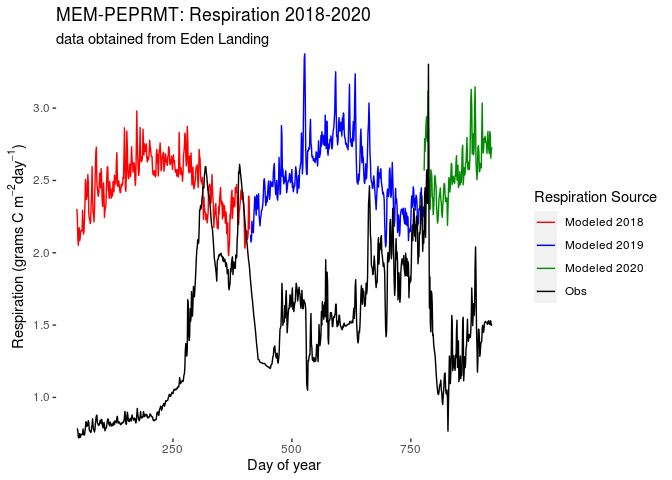
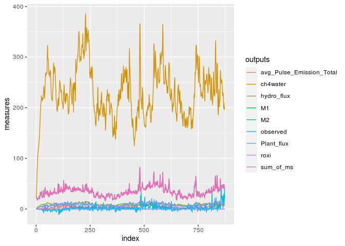
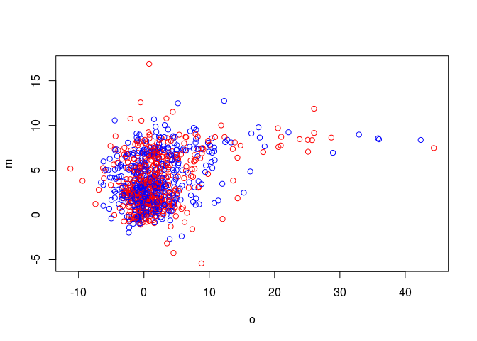
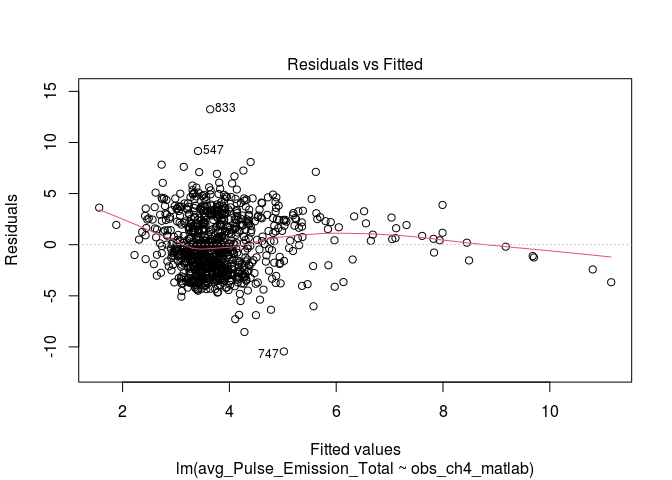
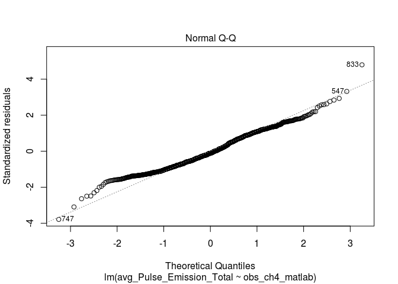
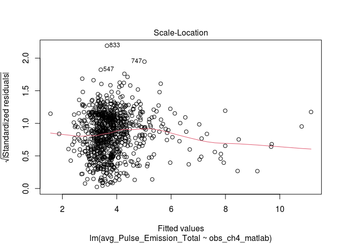
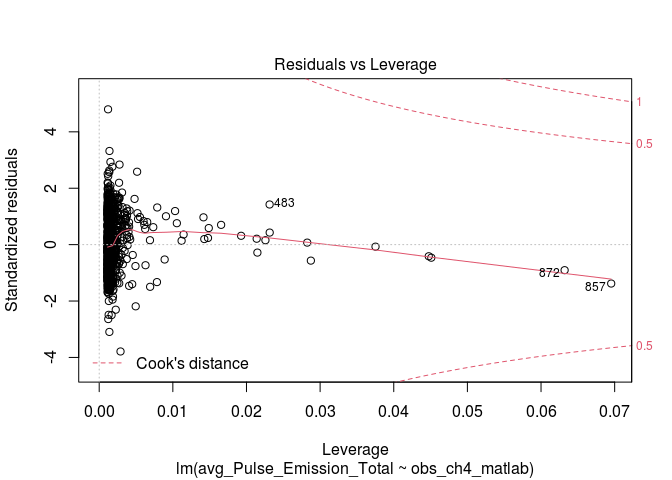
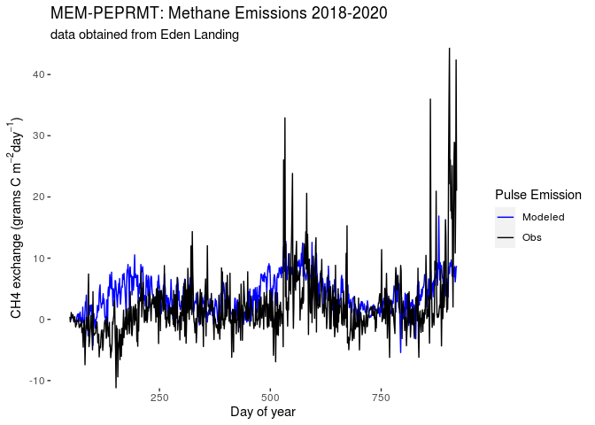

Analysis of 2018-2020 Eden Landing data using new MEM-PEPRMT
================
Michael Najarro
11/18/2020

``` r
library(pacman)
p_load(rCTM,
       knitr,
       tidyverse,
       magrittr,
       here,
       R.matlab,
       tictoc,
       beepr)
```

# *Phase 1: MEM*

### *Step 1: Run MEM with Cohorts*

``` r
#import elevation data to environment.
elevation<- read.table(file="./Data_sets/EDENLAND082620.txt",sep=",")

a <- elevation %>%
  rename(record=V1,
         S1=V2,
         S2=V3,
         elevation=V4,
         edcv=V5) %>%
  slice(-25) %>%
  summarise(elev = mean(elevation)*100) %>%
  pull(.)
```

``` r
startYear=2010
omPackingDensity = 0.82
memCohortExample2<- runMemWithCohorts(startYear=2010,#,2018,
                  endYear=startYear+99,
                  relSeaLevelRiseIni=.09,
                  relSeaLevelRiseTotal=250,
                  initElv=a,
                  meanSeaLevel=98.1,
                  meanSeaLevelDatum=0,#meanSeaLevel[1],
                  meanHighWaterDatum=194.7,
                  meanHighHighWaterDatum = NA,#213.7
                  meanHighHighWaterSpringDatum = NA,
                  suspendedSediment=0.00002,#.00003,
                  lunarNodalAmp=2.5,
                  bMax=.90,#.048,
                  zVegMin=100,
                  zVegMax=350,
                  zVegPeak=180,
                  plantElevationType="orthometric",
                  rootToShoot=2,
                  rootTurnover=0.5,
                  abovegroundTurnover = NA,
                  speciesCode = NA,
                  rootDepthMax=30,
                  shape = "linear",
                  omDecayRate=0.8,
                  recalcitrantFrac=0.35,#0.2,
                  settlingVelocity=0.275,
                  omPackingDensity = 0.82,
                  mineralPackingDensity = 2.43,
                  rootPackingDensity = omPackingDensity,
                  initialCohorts = NA,
                  uplandCohorts = NA, 
                  supertidalCohorts = NA,
                  supertidalSedimentInput = NA)  


slow <- tapply(memCohortExample2$cohorts$slow_OM,
           memCohortExample2$cohorts$year,
           FUN = mean)
slow
```

    ##      2010      2011      2012      2013      2014      2015      2016      2017 
    ## 0.1899908 0.1890455 0.1881097 0.1871830 0.1862655 0.1853568 0.1844570 0.1835660 
    ##      2018      2019      2020      2021      2022      2023      2024      2025 
    ## 0.1826834 0.1818093 0.1809436 0.1800860 0.1792366 0.1783951 0.1775615 0.1767356 
    ##      2026      2027      2028      2029      2030      2031      2032      2033 
    ## 0.1759174 0.1751067 0.1743035 0.1735075 0.1727189 0.1719373 0.1711628 0.1703953 
    ##      2034      2035      2036      2037      2038      2039      2040      2041 
    ## 0.1696346 0.1688807 0.1681334 0.1673927 0.1666586 0.1659308 0.1652094 0.1644942 
    ##      2042      2043      2044      2045      2046      2047      2048      2049 
    ## 0.1637851 0.1630822 0.1623853 0.1616943 0.1610091 0.1603298 0.1596561 0.1589881 
    ##      2050      2051      2052      2053      2054      2055      2056      2057 
    ## 0.1583256 0.1576687 0.1570172 0.1563710 0.1557301 0.1550945 0.1544640 0.1538387 
    ##      2058      2059      2060      2061      2062      2063      2064      2065 
    ## 0.1532184 0.1526030 0.1519926 0.1513871 0.1507863 0.1501903 0.1495990 0.1490124 
    ##      2066      2067      2068      2069      2070      2071      2072      2073 
    ## 0.1484303 0.1478527 0.1472797 0.1467110 0.1461467 0.1455868 0.1450311 0.1444797 
    ##      2074      2075      2076      2077      2078      2079      2080      2081 
    ## 0.1439324 0.1433893 0.1428502 0.1423152 0.1417841 0.1412571 0.1407339 0.1402146 
    ##      2082      2083      2084      2085      2086      2087      2088      2089 
    ## 0.1396991 0.1391874 0.1386794 0.1381751 0.1376745 0.1371774 0.1366840 0.1361941 
    ##      2090      2091      2092      2093      2094      2095      2096      2097 
    ## 0.1357077 0.1352247 0.1347452 0.1342691 0.1337963 0.1333268 0.1328607 0.1323977 
    ##      2098      2099      2100      2101      2102      2103      2104      2105 
    ## 0.1319380 0.1314815 0.1310281 0.1305778 0.1301307 0.1296865 0.1292454 0.1288073 
    ##      2106      2107      2108      2109 
    ## 0.1283721 0.1279399 0.1275106 0.1270841

``` r
fast <- tapply(memCohortExample2$cohorts$fast_OM,
           memCohortExample2$cohorts$year,
           FUN = mean)
fast
```

    ##         2010         2011         2012         2013         2014         2015 
    ## 3.529383e-03 7.023647e-04 1.397775e-04 2.781779e-05 5.536287e-06 1.101856e-06 
    ##         2016         2017         2018         2019         2020         2021 
    ## 2.193014e-07 4.364840e-08 8.687711e-09 1.729229e-09 3.441988e-10 6.851351e-11 
    ##         2022         2023         2024         2025         2026         2027 
    ## 1.363807e-11 2.714808e-12 5.404243e-13 1.075821e-13 2.141682e-14 4.263624e-15 
    ##         2028         2029         2030         2031         2032         2033 
    ## 8.488133e-16 1.689875e-16 3.364387e-17 6.698327e-18 1.333631e-18 2.655301e-19 
    ##         2034         2035         2036         2037         2038         2039 
    ## 5.286894e-20 1.052679e-20 2.096043e-21 4.173619e-22 8.310627e-23 1.654867e-23 
    ##         2040         2041         2042         2043         2044         2045 
    ## 3.295344e-24 6.562157e-25 1.306774e-25 2.602332e-26 5.182422e-27 1.032074e-27 
    ##         2046         2047         2048         2049         2050         2051 
    ## 2.055401e-28 4.093457e-29 8.152515e-30 1.623681e-30 3.233831e-31 6.440825e-32 
    ##         2052         2053         2054         2055         2056         2057 
    ## 1.282842e-32 2.555126e-33 5.089308e-34 1.013707e-34 2.019173e-35 4.021996e-36 
    ##         2058         2059         2060         2061         2062         2063 
    ## 8.011556e-37 1.595876e-37 3.178985e-38 6.332640e-39 1.261502e-39 2.513032e-40 
    ##         2064         2065         2066         2067         2068         2069 
    ## 5.006276e-41 9.973287e-42 1.986866e-42 3.958270e-43 7.885855e-44 1.571082e-44 
    ##         2070         2071         2072         2073         2074         2075 
    ## 3.130078e-45 6.236170e-46 1.242474e-46 2.475499e-47 4.932244e-48 9.827263e-49 
    ##         2076         2077         2078         2079         2080         2081 
    ## 1.958064e-49 3.901460e-50 7.773805e-51 1.548981e-51 3.086489e-52 6.150199e-53 
    ##         2082         2083         2084         2085         2086         2087 
    ## 1.225518e-53 2.442057e-54 4.866289e-55 9.697186e-56 1.932410e-56 3.850868e-57 
    ##         2088         2089         2090         2091         2092         2093 
    ## 7.674032e-58 1.529305e-58 3.047687e-59 6.073682e-60 1.210429e-60 2.412303e-61 
    ##         2094         2095         2096         2097         2098         2099 
    ## 4.807619e-62 9.581500e-63 1.909600e-63 3.805892e-64 7.585354e-65 1.511821e-65 
    ##         2100         2101         2102         2103         2104         2105 
    ## 3.013217e-66 6.005724e-67 1.197031e-67 2.385892e-68 4.755553e-69 9.478864e-70 
    ##         2106         2107         2108         2109 
    ## 1.889368e-70 3.766013e-71 7.506752e-72 1.496329e-72

``` r
resp <-tapply(memCohortExample2$cohorts$respired_OM,
           memCohortExample2$cohorts$year,
           FUN = mean)
resp
```

    ##         2010         2011         2012         2013         2014         2015 
    ## 3.529383e-03 7.023647e-04 1.397775e-04 2.781779e-05 5.536287e-06 1.101856e-06 
    ##         2016         2017         2018         2019         2020         2021 
    ## 2.193014e-07 4.364840e-08 8.687711e-09 1.729229e-09 3.441988e-10 6.851351e-11 
    ##         2022         2023         2024         2025         2026         2027 
    ## 1.363807e-11 2.714808e-12 5.404243e-13 1.075821e-13 2.141682e-14 4.263624e-15 
    ##         2028         2029         2030         2031         2032         2033 
    ## 8.488133e-16 1.689875e-16 3.364387e-17 6.698327e-18 1.333631e-18 2.655301e-19 
    ##         2034         2035         2036         2037         2038         2039 
    ## 5.286894e-20 1.052679e-20 2.096043e-21 4.173619e-22 8.310627e-23 1.654867e-23 
    ##         2040         2041         2042         2043         2044         2045 
    ## 3.295344e-24 6.562157e-25 1.306774e-25 2.602332e-26 5.182422e-27 1.032074e-27 
    ##         2046         2047         2048         2049         2050         2051 
    ## 2.055401e-28 4.093457e-29 8.152515e-30 1.623681e-30 3.233831e-31 6.440825e-32 
    ##         2052         2053         2054         2055         2056         2057 
    ## 1.282842e-32 2.555126e-33 5.089308e-34 1.013707e-34 2.019173e-35 4.021996e-36 
    ##         2058         2059         2060         2061         2062         2063 
    ## 8.011556e-37 1.595876e-37 3.178985e-38 6.332640e-39 1.261502e-39 2.513032e-40 
    ##         2064         2065         2066         2067         2068         2069 
    ## 5.006276e-41 9.973287e-42 1.986866e-42 3.958270e-43 7.885855e-44 1.571082e-44 
    ##         2070         2071         2072         2073         2074         2075 
    ## 3.130078e-45 6.236170e-46 1.242474e-46 2.475499e-47 4.932244e-48 9.827263e-49 
    ##         2076         2077         2078         2079         2080         2081 
    ## 1.958064e-49 3.901460e-50 7.773805e-51 1.548981e-51 3.086489e-52 6.150199e-53 
    ##         2082         2083         2084         2085         2086         2087 
    ## 1.225518e-53 2.442057e-54 4.866289e-55 9.697186e-56 1.932410e-56 3.850868e-57 
    ##         2088         2089         2090         2091         2092         2093 
    ## 7.674032e-58 1.529305e-58 3.047687e-59 6.073682e-60 1.210429e-60 2.412303e-61 
    ##         2094         2095         2096         2097         2098         2099 
    ## 4.807619e-62 9.581500e-63 1.909600e-63 3.805892e-64 7.585354e-65 1.511821e-65 
    ##         2100         2101         2102         2103         2104         2105 
    ## 3.013217e-66 6.005724e-67 1.197031e-67 2.385892e-68 4.755553e-69 9.478864e-70 
    ##         2106         2107         2108         2109 
    ## 1.889368e-70 3.766013e-71 7.506752e-72 1.496329e-72

## **Step 2: obtain the sum of slow and fast organic matter pools**

At this point I entirely skip the calculation and downscaling of NPP.

Instead I calculate two important values from MEM to input into the
respiration component of PEPRMT. These values will directly correspond
to the slow and fast organic matter components of each soil cohort from
MEM. The sum of these values approximate the carbon stored within the
labile and SOC pools described in the PEPRMT model.

The MEM ouputs for carbon -The slow and fast organic measures - will
become inputs for the ecosystem respiration component of PEPRMT.
Specifically, they will equate to the sum of slow and fast organic
matter that is within one meter below the soil surface at and up to the
time of interest (includes all years prior, up to, and include year of
interest) in accordinance with the PEPRMT model (see Oikawa 2017) to
simulate soil sampling of core data.

Note thatin previous iterations of MEM-PEPRMT in Rush Ranch, we did not
consider the 1 meter depth because the total height of the soil cohorts
from MEM were within 1 meter.

The relationship between these pools can be described as follows:

``` r
y<- tribble(
  ~MEM_Variable, ~Equiv._PEPRMNT_C_Pool, ~PEPRMNT_Variable, ~theta_element,
  "Slow_OM", "Soil Organic Carbon (SOC) Pool", "S2", "theta[5]",
  "Fast_OM", "Labile Carbon Pool", "S1", "theta[6]"
)

kable(y)
```

| MEM\_Variable | Equiv.\_PEPRMNT\_C\_Pool       | PEPRMNT\_Variable | theta\_element |
| :------------ | :----------------------------- | :---------------- | :------------- |
| Slow\_OM      | Soil Organic Carbon (SOC) Pool | S2                | theta\[5\]     |
| Fast\_OM      | Labile Carbon Pool             | S1                | theta\[6\]     |

Here I calculate the depth of the soil accreted for 2018 and filter out
the 2018 data from MEM outputs. I also check if the soil is within one
meter of the surface.

``` r
# first identify the values of slow and fast om
# that are: 
#   1. within a meter
#   2. within a time interval of the earliest
#       year up to, and including the year of 
#       interest.

#note:
# Within a given year, all rows before the newest
# incremented "age" (n+1th row) are considered past cohorts,
# so only sum the rows within a year of interest!

#2.a) create table cohort up to year 2017.
cohort <- as.data.frame(memCohortExample2$cohorts)
#cores <-- as.data.frame(memCohortExample2$core)

#2.b) create a column that calculates the height
#       of each layer.
lb <- as.vector(cohort$layer_bottom)
lt <- as.vector(cohort$layer_top)

#2.c) extract out cohort data for 2018.
cohort18 <- cohort %>%
  mutate(depth = lb-lt) %>%
   filter(year == 2018)

cohort19 <- cohort %>%
  mutate(depth = lb-lt) %>%
   filter(year == 2019)

cohort20 <- cohort %>%
  mutate(depth = lb-lt) %>%
   filter(year == 2020)

#2.d) how many layers are exactly one meter
# below the last year of interest (2020) in the depth column?
cohort20 %>%
  summarise(total_depth = sum(depth))
```

    ##   total_depth
    ## 1    51.99511

``` r
rm(a,
   elevation,
   lb,
   lt,
   fastomPackingDensity,
   omPackingDensity,
   resp,
   fast,
   slow,
   cohort18,
   cohort19,
   cohort20,
   memCohortExample2)
```

    ## Warning in rm(a, elevation, lb, lt, fastomPackingDensity, omPackingDensity, :
    ## object 'fastomPackingDensity' not found

# *Phase 2: PEPRMT*

## *Ecosystem Respiration*

### **Step 1: import your data to environment.**

``` r
data <- read_csv(file="./Data_sets/EL_2018_2020_master_9_30_20.csv") %>%
  mutate(GI = rep(0, nrow(.)),
         Season = rep(0, nrow(.))) %>%
         #wc90_filler = rep(0, nrow(data))
  select(Day_of_year,
         Discont_day_of_year,
         Air_temp_daily_ave_degree_C,
         Water_table_daily_ave_cm,
         #PAR_daily_ave_umol_m2_day,
         #FPAR,
         GPP_gC_m2_day,
         GI,
         Season,
         #wc90_filler,
         Wetland_age_years,
         Year) %>%
 filter(between(Year, 2018, 2020)) %>%
  as.data.frame(.)
```

### **Step 2: Prepare the data for peprmt Reco script**

In this step, I substitute the tower observed measures of GPP for a
vector of zeroes.

Within the PEPRMT Reco function, GPP measures are susbstituted directly
fora variable called “C2in”, which is then used to calculate the S2 pool
of carbon in PEPRMT. By converting the GPP time step measures to zero,
the S2 carbon pool depends strictly on the Labiale Carbon Pool, which is
the sum of the fast and respired organic matter pools calculated from
MEM.

``` r
# 2.a) substitute the peprmt GPP data with
#       MEM-calculated NPP data; relabel column.
data[5] <-  c(rep(0, nrow(data)))
```

### **Step 3: Execute peprmt Reco using sum of fast and slow OM of MEM for 2018**

``` r
#Run a loop for each year in a vector of years where you:
#   - extract year data
#   - store in df
#   - run mem-pep Reco on that data
#   - store df as element of list


#3.a) pull your reco function in and setup storage space
source('./Peprmt_files/PEPRMT_final_sys_CO2_Reco_reduced.R')
year_vector <- c(2018,2019,2020)
outcome_lst <- list(rep(NA, length(year_vector)))
daysofyear <- list(c(1, 365), c(366,730), c(731,920))
wetland_type <- "coastal"
     
#3.b) run the loop
  for(i in 1:length(year_vector)) {
    cohort_i <- cohort %>%
      filter(year == year_vector[i]) %>%
      mutate(depth = layer_bottom - layer_top)
    
    # set up your theta values. note that multiply by 10^6 to
    #convert from gC/cm^3 to gC/m^2, when we consider one meter
    #of soil across all years of interest.
    theta5 <- (mean(cohort_i$slow_OM)/mean(cohort_i$depth))*1000000
    theta6 <- ((mean(cohort_i$fast_OM)+mean(cohort_i$respired_OM))/mean(cohort_i$depth))*1000000
   
     # run peprmt Reco
    theta <- c(-1, 0, -1, 0, theta5, theta6)
    ER_mod_RR <- PEPRMT_final_sys_CO2_Reco(data,
                                           theta,                                           wetland_type)
    
    # merge peprmt output + obs data
    co2_i <- ER_mod_RR %>%
      as.data.frame(.) %>%
      mutate(DOY = c(data$Discont_day_of_year),
             DOY_cont = c(data$Day_of_year)) %>%
      select(Reco_full,
             DOY, 
             DOY_cont,#,
             S1,
             S2
             ) %>%
      rename(CO2_flux=Reco_full) %>%
      mutate(data_type = c(rep(paste0("mem_pep_",year_vector[i],sep=""),
                               nrow(.)))) 
    
    #filter the data between min & max values of obs data
    #for given year
    s <- unlist(daysofyear[i])
    co2_i <- co2_i %>%
      slice(s[1]:s[2])
    
    #store your dataframe iteration of Reco into the list
    outcome_lst[[i]] <- co2_i
  }
```

### **Step 4: Munge the data from loop**

``` r
#4.a) row bind the elements of loop outcomes together.
bigc02 <- do.call('rbind', outcome_lst)

#4.b) save your S1 and S2s into a separate df, then toss.
s1 <- bigc02$S1
s2 <- bigc02$S2

carbon_pools <- as.data.frame(cbind(s1, s2))
colnames(carbon_pools) <- c("S1", "S2")

#4.c) remove S1 and S2 from bigc02.
bigc02 <-bigc02 %>%
  select(-S1,-S2)

#4.d) Bring in the observed Reco data  
data2 <- read_csv(file="./Data_sets/EL_2018_2020_master_9_30_20.csv") %>%
  filter(between(Year, 2018, 2020)) %>%
  select(Reco_gC_m2_day,
         Discont_day_of_year,
         Day_of_year) %>%
  mutate(data_type = c(rep("obs_data", nrow(.)))) %>%
  rename(CO2_flux = Reco_gC_m2_day,
         DOY = Discont_day_of_year,
         DOY_cont= Day_of_year) %>%
  as.data.frame(.)


#4.c) bind loop data with observed data
bigc02 <- bigc02 %>%
  as.data.frame(.) %>%
  #slice(-(272:783)) %>%
  bind_rows(.,data2) %>%
  pivot_wider(names_from = data_type,
              values_from = CO2_flux) %>%
  pivot_longer(c(mem_pep_2018,
                 mem_pep_2019,
                 mem_pep_2020,
                 obs_data),
               names_to = "data_source",
               values_to = "Respiration")
```

### **Step 5: Plot your Reco values**

``` r
#5.a). return a plot of the model ouputs & obs. flux data
ggplot(data=bigc02,
       mapping = aes(x = DOY_cont,
                     y = Respiration,
                     color = data_source)) +
  geom_line(na.rm=TRUE) +
  labs(x = "Day of year",
       y = expression(paste("Respiration",
                             " ","(grams C"," ",
                             m^{-2},day^{-1},")",)),
       color = "Respiration Source",
       title = "MEM-PEPRMT: Respiration 2018-2020",
       subtitle = "data obtained from Eden Landing") +
  scale_y_continuous(expand=c(0,0)) +
  scale_color_manual(labels = c("Modeled 2018",
                                "Modeled 2019",
                                "Modeled 2020",
                                "Obs"),
                     values=c("red",
                              "blue",
                              "green4",
                              "black")) +
  theme(panel.grid = element_blank(),
        panel.background = element_rect(fill = "white")
        )
```

<!-- -->

## *Methane flux*

``` r
#clear the environment
rm(i,
   s,
   startYear,
   theta,
   theta6,
   theta5,
   wetland_type,
   year_vector,
   PEPRMT_final_sys_CO2_Reco,
   co2_i,
   cohort_i,
   #data2,
   daysofyear,
   s1,
   s2,
   bigc02,
   #data,
   data2
   )
```

### **Step 1: Merge the observed data with the outputs of the 2018-2020 respiration component of PEPRMT**

In order to run the methane component of PEPRMT, the model requires
measures of carbon within the labiale and SOC pools, which are
identified as columns S1 and S2 of the respiration output.

``` r
#1.a): bring back your observed data for 2018-2020 with gpps.
# make sure the columns match
data <- read_csv(file="./Data_sets/EL_2018_2020_master_9_30_20.csv")
dt <- read_csv(file="./Data_sets/EL_2018_2020_master_9_30_20.csv") %>%
  mutate(GI = rep(0, nrow(.)),
         Season = rep(0, nrow(.)), 
         wc90_filler = rep(0, nrow(data)) ) %>%
  select(Day_of_year,
         Discont_day_of_year,
         Air_temp_daily_ave_degree_C,
         Water_table_daily_ave_cm,
         PAR_daily_ave_umol_m2_day,
         FPAR,
         GPP_gC_m2_day,
         GI,
         Season,
         wc90_filler,
         Wetland_age_years,
         Year) %>%
 filter(between(Year, 2018, 2020)) %>%
  as.data.frame(.)


#1.b): merge your Reco ouputs with carbon pools and the
#       filtered 2018 data outputed from MEM.
a<-cbind(dt, carbon_pools)
rm(dt)
```

### **Step 2: Load the salinity inputs into the environment**

I will be using a revised version of the peprmt methane component that
incorporates salinity measures. The model requires three additional
inputs: Sal\_int, Sal\_slope, and salinity measures.

Note that there is no need for unit conversions applied to the S1 and S2
carbon pools. In the previous conversion in Reco, the pools converted
from g C/cm^3 to g C/m^2 when considered with respect to one meter
depth. there should be no unit changes between the phases of PEPRMT.

Note: Previously I had been applying a unit conversion to the S1 and S2
pools. I wasn’t totally sure why; I was trying to get the values to
approximate a percentage and because without a conversion totally kills
the PEPRMT Ch4. The reasons the model crashes is because currently I am
applying a random sample of S1 and S2 values around the gamma
distribution that is centered around the mean..??

``` r
#2.a)  generate a salinity vector 
salinity <- c(data$Salinity_daily_ave_ppt)

#2.b) generate the inputa data frame to feed into PEPRMT CH4.
a <- a %>%
  mutate(Sal = salinity) %>%
  select(Day_of_year:Wetland_age_years, Year, Sal, S1, S2)
```

### **Step 3: setup other inputs to Ch4 script**

``` r
# 3.a) create your model inputs
theta= c(-13, 4, -13, 4, 13, 4)

#3.b)back transform Sarah's intercepts
# commented numbers come from Sarah's email.
#equation 2 relates to the plateau of the segment regression:
#Slope2 = -0.04345077
#Intercept2 = -2.509939
Sal_Slope2 = -0.04345077
Beta_knot2 = -2.509939 + abs((12.9*Sal_Slope2))
Sal_int2 = exp(Beta_knot2) + exp(12.9*Sal_Slope2)

# equation 1 relates to the back, steeper portion of the segment
# regression, where >12.9 ppt
#Slope1 = -0.1773802
#Intercept1 = -1.139622..THIS NUMBER CANNOT BE TRUE!
# SEE POSTER IMAGE OF SALINITY GRAPH...
# USE AN APPROXIMATION FROM THE GRAPH
#INTERCEPT 1 = -0.6
Sal_Slope1 = -0.1773802
Beta_knot1 = -0.6 + abs((12.9*Sal_Slope1))
Sal_int1 = exp(Beta_knot1) + exp(12.9*Sal_Slope1)


#second attempt with back-transformed numbers below
#Sal_Slope2 <- -0.05 
#Sal_int2 <- 0.73585193

#Sal_Slope1 <- -0.2 
#Sal_int1 <- 8.92208026

#first attempt with numbers below: raw inputs.
#Sal_Slope1 <- -0.05 
#Sal_Slope2 <- -0.2 
#Sal_int1 <- -0.2
#Sal_int2 <- -2.2
```

### **Step 4: Implement the latest version of the methane component of MEM-PEP one time**

Please the see the notes within the file
PEPRMT\_final\_sys\_gammaCH4\_V5.R for details on model modifications;
this is the latest version of the methane component of PEPRMT.

``` r
#4.a) load the new methane flux script
source('./Peprmt_files/PEPRMT_Final_sys_CH4_V6.R')
```

``` r
#4.b) execute your model given the inputs
tic()
CH4_mod_RR <- CH4_daily_step(theta,
                             a,
                             Sal_int1,
                             Sal_int2,
                             Sal_Slope1,
                             Sal_Slope2,
                             #Sal_slope,
                             #Sal_int,
                             x = 1,
                             wetland_type = 2)
toc()
```

    ## 5.582 sec elapsed

``` r
beep(1)
```

do a quick plot of the ch4 outputs below

``` r
test_graph <- CH4_mod_RR
x <- data$CH4_gC_m2_day
#x<- RR_1617_master$daily.wm.gf.obs

test_graph %>%
    mutate(observed = x,
           sum_of_ms = M1 + M2,
           roxi =r_oxi,
           ch4water = ch4_water) %>%
  pivot_longer(c(avg_Pulse_Emission_Total,
                 M1,
                 M2,
                 hydro_flux,
                 Plant_flux,
                 observed,
                 sum_of_ms,
                 roxi,
                 ch4water),
               names_to='outputs',
               values_to='measures'
               ) %>%
  ggplot(data=., mapping = aes(x=index,
                               y=measures,
                               color= outputs)) +
  geom_line()
```

<!-- -->

### **Step 5: Munge your data for graphing**

``` r
#5.a) clear environ
rm(carbon_pools,
   salinity,
   p,
   Sal_int,
   Sal_slope,
   salt,
   theta,
   year_vector,
   CH4_daily_step,
   daysofyear)
```

    ## Warning in rm(carbon_pools, salinity, p, Sal_int, Sal_slope, salt, theta, :
    ## object 'p' not found

    ## Warning in rm(carbon_pools, salinity, p, Sal_int, Sal_slope, salt, theta, :
    ## object 'Sal_int' not found

    ## Warning in rm(carbon_pools, salinity, p, Sal_int, Sal_slope, salt, theta, :
    ## object 'Sal_slope' not found

    ## Warning in rm(carbon_pools, salinity, p, Sal_int, Sal_slope, salt, theta, :
    ## object 'salt' not found

    ## Warning in rm(carbon_pools, salinity, p, Sal_int, Sal_slope, salt, theta, :
    ## object 'year_vector' not found

    ## Warning in rm(carbon_pools, salinity, p, Sal_int, Sal_slope, salt, theta, :
    ## object 'daysofyear' not found

``` r
#5.b) merge your data sets:
#x: matlab observed ch4
#a: matlab data used to extract day counters
#Ch4_mod_RR: peprmt ch4 model output
data_CH4_mod_EL <- cbind(a,
                         CH4_mod_RR,
                         x) %>%
  select(Day_of_year,
         S1,
         S2,
         avg_Pulse_Emission_Total,
         x) %>%
  rename(obs_ch4_matlab = x)
```

Do side step where you calculate your rmse, r squared and cumulative
sums of obseved and predicted methane.

``` r
#5.c 
#cumulative sums
print(paste("final cumulative sum value of modeled methane is",round(cumsum(data_CH4_mod_EL$avg_Pulse_Emission_Total)[873], digits = 6)))
```

    ## [1] "final cumulative sum value of modeled methane is 3363.083759"

``` r
print(paste("final cumulative sum value of observed methane is", round(cumsum(data_CH4_mod_EL$obs_ch4_matlab)[873], digits=6) ))
```

    ## [1] "final cumulative sum value of observed methane is 1778.043461"

``` r
#rmse
o <- data_CH4_mod_EL$obs_ch4_matlab
m <- data_CH4_mod_EL$avg_Pulse_Emission_Total

print(paste("RMSE between modeled and observed methane is",round(sqrt(mean(m - o)^2), digits = 6) ))
```

    ## [1] "RMSE between modeled and observed methane is 1.815625"

``` r
#r squared via basic linear model
plot(m~o, col = c("red","blue"))
```

<!-- -->

``` r
#r squared
mymodel <- lm(avg_Pulse_Emission_Total~obs_ch4_matlab,data = data_CH4_mod_EL)

summary(mymodel)
```

    ## 
    ## Call:
    ## lm(formula = avg_Pulse_Emission_Total ~ obs_ch4_matlab, data = data_CH4_mod_EL)
    ## 
    ## Residuals:
    ##      Min       1Q   Median       3Q      Max 
    ## -10.4450  -2.0926  -0.3156   2.1008  13.2420 
    ## 
    ## Coefficients:
    ##                Estimate Std. Error t value Pr(>|t|)    
    ## (Intercept)     3.50134    0.09970   35.12   <2e-16 ***
    ## obs_ch4_matlab  0.17233    0.01705   10.11   <2e-16 ***
    ## ---
    ## Signif. codes:  0 '***' 0.001 '**' 0.01 '*' 0.05 '.' 0.1 ' ' 1
    ## 
    ## Residual standard error: 2.761 on 871 degrees of freedom
    ## Multiple R-squared:  0.105,  Adjusted R-squared:  0.1039 
    ## F-statistic: 102.1 on 1 and 871 DF,  p-value: < 2.2e-16

``` r
plot(mymodel)
```

<!-- --><!-- --><!-- --><!-- -->

``` r
#5.d) one final munge to stack your measures and observed
# measures together.
  data_CH4_mod_EL <- data_CH4_mod_EL %>%
  #  mutate(avg_Pulse_Emission_Total = avg_Pulse_Emission_Total)%>% 
    pivot_longer(c(obs_ch4_matlab,
                   avg_Pulse_Emission_Total#,
                   #obs_ch4_recent
                   ),
                 names_to ="methane_flux",
                 values_to = "CH4_measure")
```

### **Step 6: Plot model outputs alongside obsreved data**

``` r
  #6.a) plot
   ggplot(data = data_CH4_mod_EL) +
     geom_line(aes(x= Day_of_year,
                   y= CH4_measure,
                   color=methane_flux)) +
     labs(x = "Day of year",
          y = expression(paste("CH4 exchange"," ","(grams C"," ", m^{-2},day^{-1},")")),
          color = expression(paste("Pulse"," ","Emission")),
          title = "MEM-PEPRMT: Methane Emissions 2018-2020",
          subtitle = "data obtained from Eden Landing") +
     scale_y_continuous(expand=c(0,0)) +
     scale_color_manual(labels =c("Modeled",
                                  "Obs"),
                        values=c("blue",
                                 "black")) +
     theme(
       panel.grid = element_blank(),
       panel.background = element_rect(fill = "white")
     )
```

<!-- -->

### save certain data for graphing for poster presentations

``` r
save(CH4_mod_RR,
     a,
     data,
     file="/home/worker/Documents/AGU_poster_graphs/revised_EL_data.RData")
```
