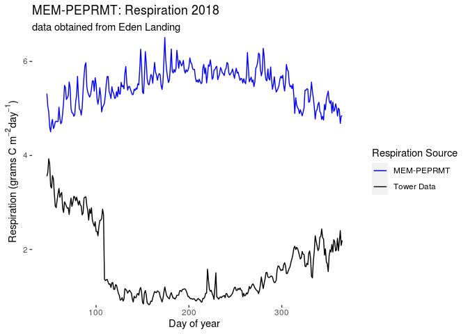
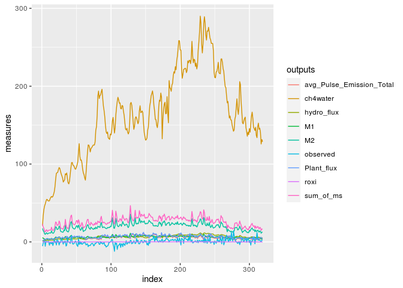
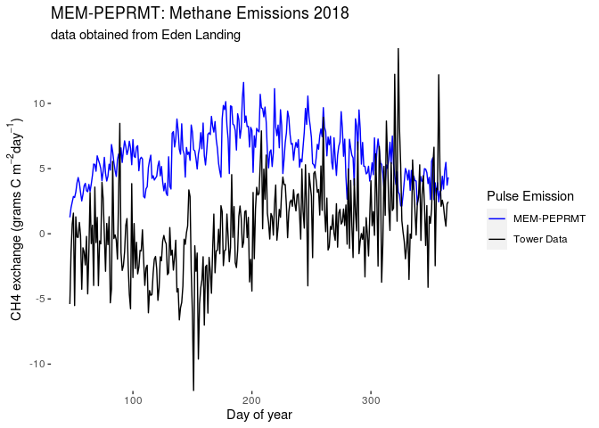

Analysis of Eden Landing using MEM-PEPRMT
================
Michael Najarro
August 17th, 2020

**Report revised on 10/21/20**

# *Background*

The MEM-PEPRMT model was created by merging Dr. Jim Morris’s Marsh
Equilibrium Model (MEM) - courtesy of Dr. James Holmquists work in
developing MEM in R - with Dr. Patty Oikawa’s Peatland Ecosystem
Photosynthesis Respiration and Methane Transport model (PEPRMT).
MEM-PEPRMT was built on data from Rush Ranch Site located in Suisun Bay
California.

These two models were originally joined by:

1.  Calculating NPP from the sum of above and below ground biomass,
    downscaled to a daily measure, was used in place of PEPRMT’s GPP and
    feed into both the Reco and methane components of PEPRMT.

2.  Slow and fast organic matter pools found within each soil accretion
    within the required time zone were added as theta values to Reco.

3.  later, the NPP was dropped from Reco, replacing the GPP with 0s and
    using only the sum of organic pools; NPP was still used in Reco.

# *Objective*

In this report I investigate a modification of MEM-PEPRMT, where NDVI is
used in place of GPP, rather than calculating NPP from MEM. This change
was recommended at the previous CCRCN team meeting. MEM will still be
used to obtain the summed pools of carbon.

In addition, I will apply the modified MEM-PEP model to data collected
from Eden Landing, located in Hayward California. This is a new site in
which the model was neither built around nor has encountered. The data
used in this analysis is centered on 2018 tower data from Eden landing
data, which already contains daily NDVI measures for the year.

As of 10/21/20, a current form of the rCTM package exists. Due to run
time errors with MEM inputs, I use an older version of MEM for this
analysis. I plan to compare the two version’s outputs.

``` r
library(pacman)
p_load(oldrCTM331,
       tidyverse,
       magrittr,
       tinytex,
       R.matlab,
       here,
       dplyr,
       tidyr,
       tibble,
       tinytex,
       knitr,
       tictoc,
       beepr)
```

# *Phase 1: MEM*

### *Step 1: Run MEM with Cohorts*

The code below implements MEM. Note that end year is defaulted to 99
years after the start year and mean sea level initial (MSL0) is set to
Mean Sea Level (MSL).

MEM can take optional inputs regarding core sampling data. core sampling
data is available for Rush Ranch at the Coastal Carbon Research
Coordination Network’s online atlas
(<https://ccrcn.shinyapps.io/CoastalCarbonAtlas/>). However for this
analysis, I exclude such data as the data is distributed across multiple
sites, distributed across general elevation classifiers. I exclude
coremin and coremax values. Note that you need to have ‘ompacking
density’ defined initially to run the ‘runmemwithcohorts’ function.

Inputs for MEM on Eden Landing can be found at the CCRCN google Drive.

Recent data updates from chamber data can provide a more accurate
measure for the Eden Landing Site elevation:

``` r
#import elevation data to environment.
elevation<- read.table(file="./Data_sets/EDENLAND082620.txt",sep=",")

a <- elevation %>%
  rename(record=V1,
         S1=V2,
         S2=V3,
         elevation=V4,
         edcv=V5) %>%
  slice(-25) %>%
  summarise(elev = mean(elevation)*100) %>%
  pull(.)
```

``` r
omPackingDensity <- 0.82

memCohortExample2 <- runMemWithCohorts(startYear=2010,
                  rslrT1=0.09, #.9
                  rslrTotal=250,
                  initElv=a,
                  MSL=98.1,
                  MHW=194.7,
                  MHHW=213.7,
                  MHHWS= 287,
                  ssc= .000020,#.000025,#.000030,
                  lunarNodalAmp=2.5,
                  bMax=.90,#0.84,#.90,#.048,
                  
                  # in Holmquist rFullBlownMemDev
                  # zVegMin is negative; exclude - sign.
                  zVegMin=100,
                  zVegMax=350,#250,#original350,
                  zVegPeak=180,                  plantElevationType="orthometric",
                  rootToShoot=2,
                  rootTurnover=0.5,
                  rootDepthMax=30,
                  shape="linear",
                  omDecayRate=0.8,
                  recalcitrantFrac=0.35,#0.2,
                  settlingVelocity=0.275,
                  omPackingDensity=0.82,
                 rootPackingDensity = omPackingDensity,
            mineralPackingDensity=2.43,
                  coreYear = 2050#,
                  #coreDepth = 50
                 # coreMins =coreMins[c(1:26),],
                 # coreMaxs = coreMaxs[c(1:26),]
)


slow <- tapply(memCohortExample2$cohorts$slow_OM,
           memCohortExample2$cohorts$year,
           FUN = mean)
slow
```

    ##      2010      2011      2012      2013      2014      2015      2016      2017 
    ## 0.1345433 0.1353870 0.1362249 0.1370601 0.1378915 0.1387180 0.1395381 0.1403504 
    ##      2018      2019      2020      2021      2022      2023      2024      2025 
    ## 0.1411533 0.1419456 0.1427259 0.1434936 0.1442480 0.1449891 0.1457174 0.1464336 
    ##      2026      2027      2028      2029      2030      2031      2032      2033 
    ## 0.1471388 0.1478343 0.1485212 0.1492002 0.1498718 0.1505359 0.1511920 0.1518388 
    ##      2034      2035      2036      2037      2038      2039      2040      2041 
    ## 0.1524746 0.1530973 0.1537044 0.1542933 0.1548616 0.1554070 0.1559280 0.1564232 
    ##      2042      2043      2044      2045      2046      2047      2048      2049 
    ## 0.1568923 0.1573354 0.1577527 0.1581451 0.1585131 0.1588569 0.1591764 0.1594707 
    ##      2050      2051      2052      2053      2054      2055      2056      2057 
    ## 0.1597380 0.1599757 0.1601804 0.1603480 0.1604742 0.1605542 0.1605838 0.1605590 
    ##      2058      2059      2060      2061      2062      2063      2064      2065 
    ## 0.1604763 0.1603331 0.1601270 0.1598558 0.1595175 0.1591096 0.1586288 0.1580711 
    ##      2066      2067      2068      2069      2070      2071      2072      2073 
    ## 0.1574512 0.1568361 0.1562259 0.1556203 0.1550195 0.1544233 0.1538316 0.1532445 
    ##      2074      2075      2076      2077      2078      2079      2080      2081 
    ## 0.1526618 0.1520835 0.1515096 0.1509400 0.1503747 0.1498136 0.1492567 0.1487039 
    ##      2082      2083      2084      2085      2086      2087      2088      2089 
    ## 0.1481552 0.1476105 0.1470698 0.1465330 0.1460002 0.1454712 0.1449460 0.1444246 
    ##      2090      2091      2092      2093      2094      2095      2096      2097 
    ## 0.1439070 0.1433930 0.1428827 0.1423761 0.1418730 0.1413734 0.1408774 0.1403848 
    ##      2098      2099      2100      2101      2102      2103      2104      2105 
    ## 0.1398956 0.1394099 0.1389275 0.1384484 0.1379727 0.1375002 0.1370309 0.1365648 
    ##      2106      2107      2108      2109 
    ## 0.1361019 0.1356421 0.1351854 0.1347317

``` r
fast <- tapply(memCohortExample2$cohorts$fast_OM,
           memCohortExample2$cohorts$year,
           FUN = mean)
fast
```

    ##         2010         2011         2012         2013         2014         2015 
    ## 3.538011e-03 3.520320e-03 3.507579e-03 3.501420e-03 3.494811e-03 3.485756e-03 
    ##         2016         2017         2018         2019         2020         2021 
    ## 3.473516e-03 3.457803e-03 3.438586e-03 3.416033e-03 3.390526e-03 3.362682e-03 
    ##         2022         2023         2024         2025         2026         2027 
    ## 3.333344e-03 3.303517e-03 3.274252e-03 3.246491e-03 3.220932e-03 3.197914e-03 
    ##         2028         2029         2030         2031         2032         2033 
    ## 3.177366e-03 3.158807e-03 3.141395e-03 3.124022e-03 3.105421e-03 3.084287e-03 
    ##         2034         2035         2036         2037         2038         2039 
    ## 3.059386e-03 3.029659e-03 2.994326e-03 2.952987e-03 2.905695e-03 2.852992e-03 
    ##         2040         2041         2042         2043         2044         2045 
    ## 2.795857e-03 2.735575e-03 2.673546e-03 2.611067e-03 2.549142e-03 2.488332e-03 
    ##         2046         2047         2048         2049         2050         2051 
    ## 2.428665e-03 2.369611e-03 2.310109e-03 2.248648e-03 2.183396e-03 2.112375e-03 
    ##         2052         2053         2054         2055         2056         2057 
    ## 2.033673e-03 1.945676e-03 1.847277e-03 1.738019e-03 1.618139e-03 1.488466e-03 
    ##         2058         2059         2060         2061         2062         2063 
    ## 1.350214e-03 1.204688e-03 1.052986e-03 8.957420e-04 7.329608e-04 5.639508e-04 
    ##         2064         2065         2066         2067         2068         2069 
    ## 3.873523e-04 2.012504e-04 4.009225e-05 7.987127e-06 1.591210e-06 3.170085e-07 
    ##         2070         2071         2072         2073         2074         2075 
    ## 6.315690e-08 1.258280e-08 2.506917e-09 4.994698e-10 9.951414e-11 1.982744e-11 
    ##         2076         2077         2078         2079         2080         2081 
    ## 3.950523e-12 7.871344e-13 1.568373e-13 3.125041e-14 6.226847e-15 1.240757e-15 
    ##         2082         2083         2084         2085         2086         2087 
    ## 2.472357e-16 4.926535e-17 9.816978e-18 1.956230e-18 3.898233e-19 7.768218e-20 
    ##         2088         2089         2090         2091         2092         2093 
    ## 1.548035e-20 3.084933e-21 6.147751e-22 1.225159e-22 2.441598e-23 4.865879e-24 
    ##         2094         2095         2096         2097         2098         2099 
    ## 9.697371e-25 1.932645e-25 3.851728e-26 7.676520e-27 1.529955e-27 3.049284e-28 
    ##         2100         2101         2102         2103         2104         2105 
    ## 6.077466e-29 1.211302e-29 2.414279e-30 4.812021e-31 9.591196e-32 1.911715e-32 
    ##         2106         2107         2108         2109 
    ## 3.810468e-33 7.595191e-34 1.513923e-34 3.017686e-35

``` r
resp <-tapply(memCohortExample2$cohorts$respired_OM,
           memCohortExample2$cohorts$year,
           FUN = mean)
resp
```

    ##         2010         2011         2012         2013         2014         2015 
    ## 3.538011e-03 3.520320e-03 3.507579e-03 3.501420e-03 3.494811e-03 3.485756e-03 
    ##         2016         2017         2018         2019         2020         2021 
    ## 3.473516e-03 3.457803e-03 3.438586e-03 3.416033e-03 3.390526e-03 3.362682e-03 
    ##         2022         2023         2024         2025         2026         2027 
    ## 3.333344e-03 3.303517e-03 3.274252e-03 3.246491e-03 3.220932e-03 3.197914e-03 
    ##         2028         2029         2030         2031         2032         2033 
    ## 3.177366e-03 3.158807e-03 3.141395e-03 3.124022e-03 3.105421e-03 3.084287e-03 
    ##         2034         2035         2036         2037         2038         2039 
    ## 3.059386e-03 3.029659e-03 2.994326e-03 2.952987e-03 2.905695e-03 2.852992e-03 
    ##         2040         2041         2042         2043         2044         2045 
    ## 2.795857e-03 2.735575e-03 2.673546e-03 2.611067e-03 2.549142e-03 2.488332e-03 
    ##         2046         2047         2048         2049         2050         2051 
    ## 2.428665e-03 2.369611e-03 2.310109e-03 2.248648e-03 2.183396e-03 2.112375e-03 
    ##         2052         2053         2054         2055         2056         2057 
    ## 2.033673e-03 1.945676e-03 1.847277e-03 1.738019e-03 1.618139e-03 1.488466e-03 
    ##         2058         2059         2060         2061         2062         2063 
    ## 1.350214e-03 1.204688e-03 1.052986e-03 8.957420e-04 7.329608e-04 5.639508e-04 
    ##         2064         2065         2066         2067         2068         2069 
    ## 3.873523e-04 2.012504e-04 4.009225e-05 7.987127e-06 1.591210e-06 3.170085e-07 
    ##         2070         2071         2072         2073         2074         2075 
    ## 6.315690e-08 1.258280e-08 2.506917e-09 4.994698e-10 9.951414e-11 1.982744e-11 
    ##         2076         2077         2078         2079         2080         2081 
    ## 3.950523e-12 7.871344e-13 1.568373e-13 3.125041e-14 6.226847e-15 1.240757e-15 
    ##         2082         2083         2084         2085         2086         2087 
    ## 2.472357e-16 4.926535e-17 9.816978e-18 1.956230e-18 3.898233e-19 7.768218e-20 
    ##         2088         2089         2090         2091         2092         2093 
    ## 1.548035e-20 3.084933e-21 6.147751e-22 1.225159e-22 2.441598e-23 4.865879e-24 
    ##         2094         2095         2096         2097         2098         2099 
    ## 9.697371e-25 1.932645e-25 3.851728e-26 7.676520e-27 1.529955e-27 3.049284e-28 
    ##         2100         2101         2102         2103         2104         2105 
    ## 6.077466e-29 1.211302e-29 2.414279e-30 4.812021e-31 9.591196e-32 1.911715e-32 
    ##         2106         2107         2108         2109 
    ## 3.810468e-33 7.595191e-34 1.513923e-34 3.017686e-35

## **Step 2: obtain the sum of slow and fast organic matter pools**

At this point I entirely skip the calculation and downscaling of NPP.

Instead I calculate two important values from MEM to input into the
respiration component of PEPRMT. These values will directly correspond
to the slow and fast organic matter components of each soil cohort from
MEM. The sum of these values approximate the carbon stored within the
labile and SOC pools described in the PEPRMT model.

The MEM ouputs for carbon -The slow and fast organic measures - will
become inputs for the ecosystem respiration component of PEPRMT.
Specifically, they will equate to the sum of slow and fast organic
matter that is within one meter below the soil surface at and up to the
time of interest (includes all years prior, up to, and include year of
interest) in accordinance with the PEPRMT model (see Oikawa 2017) to
simulate soil sampling of core data.

Note thatin previous iterations of MEM-PEPRMT in Rush Ranch, we did not
consider the 1 meter depth because the total height of the soil cohorts
from MEM were within 1 meter.

The relationship between these pools can be described as follows:

``` r
y<- tribble(
  ~MEM_Variable, ~Equiv._PEPRMNT_C_Pool, ~PEPRMNT_Variable, ~theta_element,
  "Slow_OM", "Soil Organic Carbon (SOC) Pool", "S2", "theta[5]",
  "Fast_OM", "Labile Carbon Pool", "S1", "theta[6]"
)

kable(y)
```

| MEM\_Variable | Equiv.\_PEPRMNT\_C\_Pool       | PEPRMNT\_Variable | theta\_element |
| :------------ | :----------------------------- | :---------------- | :------------- |
| Slow\_OM      | Soil Organic Carbon (SOC) Pool | S2                | theta\[5\]     |
| Fast\_OM      | Labile Carbon Pool             | S1                | theta\[6\]     |

Here I calculate the depth of the soil accreted for 2018 and filter out
the 2018 data from MEM outputs. I also check if the soil is within one
meter of the surface.

``` r
# first identify the values of slow and fast om
# that are: 
#   1. within a meter
#   2. within a time interval of the earliest
#       year up to, and including the year of 
#       interest.

#note:
# Within a given year, all rows before the newest
# incremented "age" (n+1th row) are considered past cohorts,
# so only sum the rows within a year of interest!

#2.a) create table cohort up to year 2017.
cohort <- as.data.frame(memCohortExample2$cohorts)
#cores <-- as.data.frame(memCohortExample2$core)

#2.b) create a column that calculates the height
#       of each layer.
lb <- as.vector(cohort$layer_bottom)
lt <- as.vector(cohort$layer_top)

#2.c) extract out cohort data for 2018.
cohort18 <- cohort %>%
  mutate(depth = lb-lt) %>%
   filter(year == 2018)

#2.d) how many layers are exactly one meter
# below the last year of interest (2020) in the depth column?
cohort18 %>%
  summarise(total_depth = sum(depth))
```

    ##   total_depth
    ## 1    40.34856

# *Phase 2: PEPRMT*

## *Ecosystem Respiration*

### **Step 1: import your data to environment.**

Note that there are two important data sets to load into the
environment:

1.  the Eden Landing data for 2018

2.  salinity data for eden landing, from 2018-2020 data provided by
    Patty.

<!-- end list -->

``` r
#1.a) import the tower data data to environment
EL_2018_master <- readMat(here('./Data_sets/2018_EL_data/EL_2018_master.mat'))

colnames(EL_2018_master$data[[1]]) <- c("daily_DOY_cont",
"daily_DOY_disc",
"daily_TA",
"daily_WT",
"daily_PAR",
"FPAR_1",
"daily_gpp_obs",
"NDVI_placeholder",
"Season_daily_co2_random_error",
"daily_co2_gapfilling_error",
"daily_wetland_age",
"FPAR_2")

EL_obs18 <- EL_2018_master$data[[1]]

EL_obs18 <- EL_obs18 %>%
  as.data.frame(.) %>%
  mutate(daily_DOY_disc = as.integer(daily_DOY_disc),
         daily_DOY_cont = as.integer(daily_DOY_cont))
```

### **Step 2: Prepare the data for peprmt Reco script**

In this step, I substitute the tower observed measures of GPP for a
vector of zeroes.

Within the PEPRMT Reco function, GPP measures are susbstituted directly
fora variable called “C2in”, which is then used to calculate the S2 pool
of carbon in PEPRMT. By converting the GPP time step measures to zero,
the S2 carbon pool depends strictly on the Labiale Carbon Pool, which is
the sum of the fast and respired organic matter pools calculated from
MEM.

``` r
# 2.a) substitute the peprmt GPP data with
#       MEM-calculated NPP data; relabel column.
EL_obs18[7] <-  c(rep(0, nrow(EL_obs18)))
```

### **Step 3: Execute peprmt Reco using sum of fast and slow OM of MEM for 2018**

I multiply the sum of the decayed organic matterpools by 10^6 because
the units for each pool’s decay rate is at gC/cm^3 in MEM, while in
PEPRMT, the units for theta are in gC/m^2. Multiplying gC/cm^3 by
100<sup>3cm</sup>3 will produce gC/m^2. We can bridge the gap between
these two units when considering, as stated in Oikawa et al. 2017, that
PEPRMT looks at only the first meter below the marsh soil surface. Thus
the total depth of the soil needs to be considered. Note that MEM
outputs its units typically in grams and centimeters.

Note that the respiration component of peprmt is producing heterotrophic
respiration, not total ecosystem respiration (both hetero and
autotroph).

``` r
#2.a) sum the slow_om and fast_om values for theta
# note: with original settings, theta5 and 6 multiplied by 78
# sets theta5 to 57181.228 and theta6 to 5795.37515
theta5 <- mean(cohort18$slow_OM)*(1*10^6)
theta6 <- (mean(cohort18$fast_OM)+mean(cohort18$respired_OM))*(1*10^6)


#theta5<-theta5*78
#theta6<-theta6*78
#theta5 <- sum(cohort18$slow_OM)*(1*10^6)
#theta6 <- (sum(cohort18$fast_OM)+sum(cohort18$respired_OM))*(1*10^6)

theta <- c(-1, 0, -1, 0, theta5, theta6)

#2.b) run reco
source('./Peprmt_files/PEPRMT_final_sys_CO2_Reco.R')
PEPRMT_final_sys_CO2_Reco(EL_obs18,
                          theta,
                          wetland_type="coastal")
```

### **Step 3: Plot the peprmt Reco ouputs relative to observed data**

``` r
#3.a) load reco model results
load(file="./Data_sets/CH4_input.Rdata")

#3.b) pull out obsreved Reco from matlab data and recent EL data #     from Patty + day counter data.
rd <- read_csv(file="./Data_sets/EL_2018_2020_master_9_30_20.csv")

d <- rd %>%
  filter(Year ==2018)%>%
  select(Reco_gC_m2_day) %>%
  pull(.) %>%
  c(0,.)

b<- c(EL_2018_master$daily.er.obs)
days <- c(EL_obs18$daily_DOY_cont)

#3.c) munge the model ouput data to include observed data +
#     day counters.
Reco_output <- Reco_output %>%
  mutate(obs_Reco_matlab = b,
         #obs_Reco_recent = d,
         Day_of_year=days) %>%
  rename(MEM_PEPRMT_Reco = Reco_full) %>%
  pivot_longer(c(MEM_PEPRMT_Reco,
                 obs_Reco_matlab,
                 #obs_Reco_recent
                 ),
               names_to= "Respiration",
               values_to ="Measures")

#3.d) now plot data
ggplot(data = Reco_output) +
  geom_line(mapping=aes(x=Day_of_year, y= Measures, color=Respiration)) +
   labs(x = "Day of year",
        y = expression(paste("Respiration",
                             " ","(grams C"," ",
                             m^{-2},day^{-1},")",)),
                             #" ",g^{3},m^{2},day^{-1})),
        color = "Respiration Source",
        title = "MEM-PEPRMT: Respiration 2018",
        subtitle = "data obtained from Eden Landing") +
   #scale_fill_discrete(name ="Source", labels = "MEM-PEPRMT", "Obs") +
   scale_y_continuous(expand=c(0,0)) +
   scale_color_manual(labels =c("MEM-PEPRMT", "Tower Data"),
                      values=c("blue",
                               "black"#,
                               #"red"
                               )) +
   theme(
     panel.grid = element_blank(),
     panel.background = element_rect(fill = "white")
   )
```

<!-- -->

At this step it is important to evaluate the Reco results so far. Within
the data file "ELM-1812\_wc-porosity\_updated.xlsx the estimated percent
of organic matter found within the Eden Landing sample core data is
15.25% per core. Cutting this pecentage in half would indicate a Carbon
ratio of 7.63%.

Applying this percntage to the bulk density (converted to g/m^3, which
is 820821.88) of the cores indicates 125175.34 of the bulk density is
organic matter. Assuming that approximately half of the organic matter
percentage is comprised of carbon leaves us with 62,587.67 grams of
Carbon/m^3.

In theory the Reco output of PEPRMT should approximate the Carbon
quantity calculated previously.

## *Methane flux*

``` r
#clear the environment
rm(lb,
   lt,
   omPackingDensity,
   theta5,
   theta6,
   theta,
   PEPRMT_final_sys_CO2_Reco,
   elevation,
   cohort,
   #theta,
   #memCohortExample2,
   a,
   b,
   d,
   days
   )
```

### **Step 1: Merge the observed data with the outputs of the 2016 respiration component of peprmt**

In order to run the methane component of PEPRMT, the model requires
measures of carbon within the labiale and SOC pools, which are
identified as columns S1 and S2 of the respiration output.

In previous runs of MEM-PEPERMT, the model ran the methane component
using NPP measures from MEM, downscaled to a daily timestep measure in
place of GPP.

Here I now test whether NDVI works as a proxy for GPP, by substituting
NDVI in place of GPP.

``` r
#1.a): reload data from Reco model
load(file="./Data_sets/CH4_input.Rdata")

#1.b): merge your Reco ouputs with the filtered 2018 data
#         outputed from MEM.
a<-cbind(EL_obs18, Reco_output)
p<- c(EL_2018_master$daily.gpp.obs)

a <- a %>%
  select(daily_DOY_cont,
         daily_DOY_disc,
         daily_TA,
         daily_WT,
         daily_PAR,
         FPAR_1,
         daily_gpp_obs,
        NDVI_placeholder,
        #NDVI_placeholder,
         #daily_gpp_obs,
         Season_daily_co2_random_error,
         daily_co2_gapfilling_error,
         daily_wetland_age,
         FPAR_2,
         S1,
         S2) %>%
  #rename(ndvi_inplace_gpp=NDVI_placeholder) %>%
  mutate(daily_gpp_obs = p)
```

### **Step 2: Load the salinity inputs into the environment**

I will be using a revised version of the peprmt methane component that
incorporates salinity measures. The model requires three additional
inputs: Sal\_int, Sal\_slope, and salinity measures.

Note that there is no need for unit conversions applied to the S1 and S2
carbon pools. In the previous conversion in Reco, the pools converted
from g C/cm^3 to g C/m^2 when considered with respect to one meter
depth. there should be no unit changes between the phases of PEPRMT.

Note: Previously I had been applying a unit conversion to the S1 and S2
pools. I wasn’t totally sure why; I was trying to get the values to
approximate a percentage and because without a conversion totally kills
the PEPRMT Ch4. The reasons the model crashes is because currently I am
applying a random sample of S1 and S2 values around the gamma
distribution that is centered around the mean..??

``` r
#2.a) load in to the 2018-2020 EL data to obtain salinity for'18
salinity <- read.csv(file=paste("./Data_sets/EL_2018_2020_master_9_30_20.csv",sep=""))

#2.b) generate a salinity vector.
salt <- salinity %>%
  filter(Year == 2018) %>%
  select(Salinity_daily_ave_ppt) %>%
  pull() %>%
  c(38,.)

#2.c) generate the inputa data frame to feed into PEPRMT CH4.
a <- a %>%
  mutate(Sal = salt) %>%
  select(daily_DOY_cont:FPAR_2, Sal, S1, S2) %>%
  mutate(S1 = S1,#*.0000001,
         S2 = S2# *.0000001
         )
```

### **Step 3: setup other inputs to Ch4 script**

``` r
# 3.a) create your model inputs
theta= c(-9, 2, -9, 2, 6, 2)
#theta= c(-4, 2, -4, 2, 6, 2)
#theta= c(-5, 1, -5, 1, 5, 1)
Sal_int <- 0.215850539
Sal_slope <- -0.008947612
```

### **Step 4: Implement the latest version of the methane component of MEM-PEP one time**

Please the see the notes within the file
PEPRMT\_final\_sys\_gammaCH4\_V4.R for details on model modifications;
this is the latest version of the methane component of PEPRMT.

``` r
#4.a) load the new methane flux script
#source('./Peprmt_files/PEPRMT_Final_sys_CH4gamma_V4.R')
source('./Peprmt_files/PEPRMT_Final_sys_CH4_V5.R')
```

``` r
#21.b) execute your model given the inputs
tic()
CH4_mod_RR <- CH4_daily_step(theta,
                             a,
                             Sal_slope,
                             Sal_int,
                             x = 1,
                             wetland_type = 2)
toc()
```

    ## 1.756 sec elapsed

``` r
beep(1)
```

do a quick plot of the ch4 outputs below

``` r
test_graph <- CH4_mod_RR
x<- EL_2018_master$daily.ch4.obs

test_graph %>%
    mutate(observed = x,
           sum_of_ms = M1 + M2,
           roxi =r_oxi,
           ch4water = ch4_water) %>%
  pivot_longer(c(avg_Pulse_Emission_Total,
                 M1,
                 M2,
                 hydro_flux,
                 Plant_flux,#,
                 observed,
                 sum_of_ms,
                 roxi,
                 ch4water),
               names_to='outputs',
               values_to='measures'
               ) %>%
  ggplot(data=., mapping = aes(x=index, y=measures, color= outputs)) +
  geom_line()
```

<!-- -->

### **Step 5: Plot model outputs alongside obsreved data**

``` r
#5.a) clear environ
# rm(#Reco_output,
#    salinity,
#    p,
#    Sal_int,
#    Sal_slope,
#    theta,
#    salt)
```

``` r
#5.b) merge your data sets:
#w: matlab observed ch4
#a: matlab data used to extract day counters
#Ch4_mod_RR: peprmt ch4 model output
# rd: recent Eden landing tower data from 2018-2020;contains
#     methane tower data.

rd <- read_csv(file="./Data_sets/EL_2018_2020_master_9_30_20.csv")
d <- rd %>%
  filter(Year ==2018)%>%
  select(CH4_gC_m2_day) %>%
  pull(.) %>%
  c(0,.)

w <- c(EL_2018_master$daily.ch4.obs)

data_CH4_mod_EL <- cbind(a,CH4_mod_RR,w,d) %>%
  select(daily_DOY_cont,
         S1,
         S2,
         avg_Pulse_Emission_Total,
         w,
         #d
         ) %>%
  rename( obs_ch4_matlab = w#,
          #obs_ch4_recent = d
          )

#data_CH4_mod_EL <- data_CH4_mod_EL[,c(1,14,15,17,18)]
#data_CH4_mod_EL<-rename(data_CH4_mod_EL, obs_ch4 = w)

#5.c) unit change on the microsite column
# multiplied by 1000 to get from micro to nano moles.
  data_CH4_mod_EL <- data_CH4_mod_EL %>%
    mutate(avg_Pulse_Emission_Total = avg_Pulse_Emission_Total)%>% #*-1000) %>%
    pivot_longer(c(obs_ch4_matlab,
                   avg_Pulse_Emission_Total#,
                   #obs_ch4_recent
                   ),
                 names_to ="methane_flux",
                 values_to = "CH4_measure")
  
  #5.d) plot
   ggplot(data = data_CH4_mod_EL) +
     geom_line(aes(x= daily_DOY_cont,
                   y= CH4_measure,
                   color=methane_flux)) +
     labs(x = "Day of year",
          y = expression(paste("CH4 exchange"," ","(grams C"," ", m^{-2},day^{-1},")")),
          color = expression(paste("Pulse"," ","Emission")),
          title = "MEM-PEPRMT: Methane Emissions 2018",
          subtitle = "data obtained from Eden Landing") +
     scale_y_continuous(expand=c(0,0)) +
     scale_color_manual(labels =c("MEM-PEPRMT",
                                  "Tower Data"),
                        values=c("blue",
                                 "black"#,"grey"
                                 )) +
     theme(
       panel.grid = element_blank(),
       panel.background = element_rect(fill = "white")
     )
```

<!-- -->
