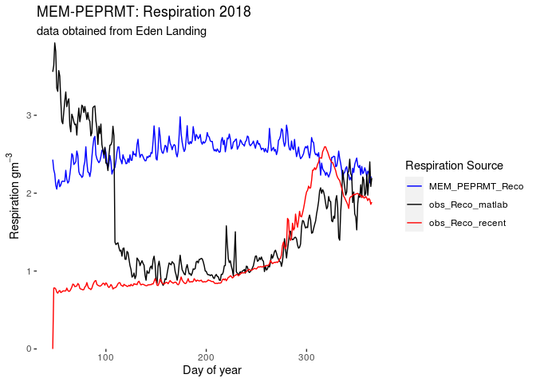
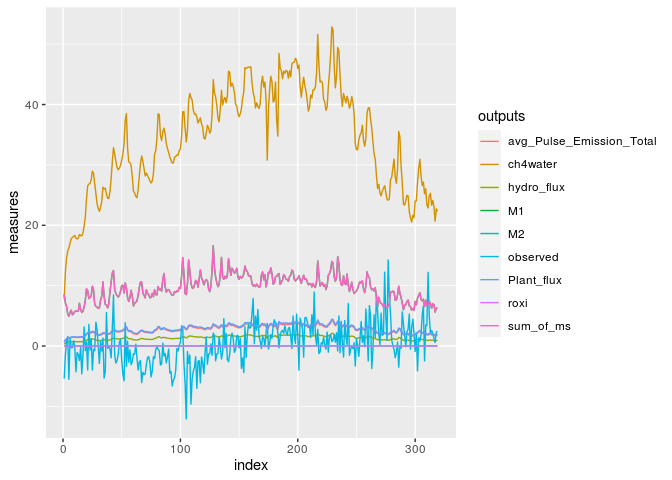
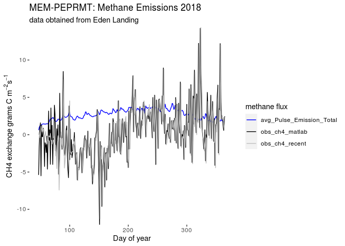

Analysis of Eden Landing using MEM-PEPRMT 2
================
Michael Najarro
11/13/2020

``` r
library(pacman)
p_load(rCTM,
       tidyverse,
       magrittr,
       here,
       R.matlab,
       tictoc,
       beepr)
#lsf.str("package:rCTM")
```

# *Phase 1: MEM*

### *Step 1: Run MEM with Cohorts*

Recent data updates from chamber data can provide a more accurate
measure for the Eden Landing Site elevation:

``` r
elevation<- read.table(file="./Data_sets/EDENLAND082620.txt",sep=",")

x <- elevation %>%
  rename(record=V1,
         S1=V2,
         S2=V3,
         elevation=V4,
         edcv=V5) %>%
  slice(-25) %>%
  summarise(elev = mean(elevation)*100) %>%
  pull(.)
```

The code below implements MEM. Inputs for MEM on Eden Landing can be
found at the CCRCN google Drive.

``` r
startYear=2018
omPackingDensity = 0.82
memCohortExample2<- runMemWithCohorts(startYear=2010,#,2018,
                  endYear=startYear+99,
                  relSeaLevelRiseIni=.09,
                  relSeaLevelRiseTotal=250,
                  initElv=x,
                  meanSeaLevel=98.1,
                  meanSeaLevelDatum=0,#meanSeaLevel[1],
                  meanHighWaterDatum=194.7,
                  meanHighHighWaterDatum = NA,#213.7
                  meanHighHighWaterSpringDatum = NA,
                  suspendedSediment=0.00002,#.00003,
                  lunarNodalAmp=2.5,
                  bMax=.90,#.048,
                  zVegMin=100,
                  zVegMax=350,
                  zVegPeak=180,
                  plantElevationType="orthometric",
                  rootToShoot=2,
                  rootTurnover=0.5,
                  abovegroundTurnover = NA,
                  speciesCode = NA,
                  rootDepthMax=30,
                  shape = "linear",
                  omDecayRate=0.8,
                  recalcitrantFrac=0.35,#0.2,
                  settlingVelocity=0.275,
                  omPackingDensity = 0.82,
                  mineralPackingDensity = 2.43,
                  rootPackingDensity = omPackingDensity,
                  initialCohorts = NA,
                  uplandCohorts = NA, 
                  supertidalCohorts = NA,
                  supertidalSedimentInput = NA)  


slow <- tapply(memCohortExample2$cohorts$slow_OM,
           memCohortExample2$cohorts$year,
           FUN = mean)
slow
```

    ##      2010      2011      2012      2013      2014      2015      2016      2017 
    ## 0.1899908 0.1890455 0.1881097 0.1871830 0.1862655 0.1853568 0.1844570 0.1835660 
    ##      2018      2019      2020      2021      2022      2023      2024      2025 
    ## 0.1826834 0.1818093 0.1809436 0.1800860 0.1792366 0.1783951 0.1775615 0.1767356 
    ##      2026      2027      2028      2029      2030      2031      2032      2033 
    ## 0.1759174 0.1751067 0.1743035 0.1735075 0.1727189 0.1719373 0.1711628 0.1703953 
    ##      2034      2035      2036      2037      2038      2039      2040      2041 
    ## 0.1696346 0.1688807 0.1681334 0.1673927 0.1666586 0.1659308 0.1652094 0.1644942 
    ##      2042      2043      2044      2045      2046      2047      2048      2049 
    ## 0.1637851 0.1630822 0.1623853 0.1616943 0.1610091 0.1603298 0.1596561 0.1589881 
    ##      2050      2051      2052      2053      2054      2055      2056      2057 
    ## 0.1583256 0.1576687 0.1570172 0.1563710 0.1557301 0.1550945 0.1544640 0.1538387 
    ##      2058      2059      2060      2061      2062      2063      2064      2065 
    ## 0.1532184 0.1526030 0.1519926 0.1513871 0.1507863 0.1501903 0.1495990 0.1490124 
    ##      2066      2067      2068      2069      2070      2071      2072      2073 
    ## 0.1484303 0.1478527 0.1472797 0.1467110 0.1461467 0.1455868 0.1450311 0.1444797 
    ##      2074      2075      2076      2077      2078      2079      2080      2081 
    ## 0.1439324 0.1433893 0.1428502 0.1423152 0.1417841 0.1412571 0.1407339 0.1402146 
    ##      2082      2083      2084      2085      2086      2087      2088      2089 
    ## 0.1396991 0.1391874 0.1386794 0.1381751 0.1376745 0.1371774 0.1366840 0.1361941 
    ##      2090      2091      2092      2093      2094      2095      2096      2097 
    ## 0.1357077 0.1352247 0.1347452 0.1342691 0.1337963 0.1333268 0.1328607 0.1323977 
    ##      2098      2099      2100      2101      2102      2103      2104      2105 
    ## 0.1319380 0.1314815 0.1310281 0.1305778 0.1301307 0.1296865 0.1292454 0.1288073 
    ##      2106      2107      2108      2109      2110      2111      2112      2113 
    ## 0.1283721 0.1279399 0.1275106 0.1270841 0.1266605 0.1262397 0.1258217 0.1254064 
    ##      2114      2115      2116      2117 
    ## 0.1249939 0.1245841 0.1241770 0.1237725

``` r
fast <- tapply(memCohortExample2$cohorts$fast_OM,
           memCohortExample2$cohorts$year,
           FUN = mean)
fast
```

    ##         2010         2011         2012         2013         2014         2015 
    ## 3.529383e-03 7.023647e-04 1.397775e-04 2.781779e-05 5.536287e-06 1.101856e-06 
    ##         2016         2017         2018         2019         2020         2021 
    ## 2.193014e-07 4.364840e-08 8.687711e-09 1.729229e-09 3.441988e-10 6.851351e-11 
    ##         2022         2023         2024         2025         2026         2027 
    ## 1.363807e-11 2.714808e-12 5.404243e-13 1.075821e-13 2.141682e-14 4.263624e-15 
    ##         2028         2029         2030         2031         2032         2033 
    ## 8.488133e-16 1.689875e-16 3.364387e-17 6.698327e-18 1.333631e-18 2.655301e-19 
    ##         2034         2035         2036         2037         2038         2039 
    ## 5.286894e-20 1.052679e-20 2.096043e-21 4.173619e-22 8.310627e-23 1.654867e-23 
    ##         2040         2041         2042         2043         2044         2045 
    ## 3.295344e-24 6.562157e-25 1.306774e-25 2.602332e-26 5.182422e-27 1.032074e-27 
    ##         2046         2047         2048         2049         2050         2051 
    ## 2.055401e-28 4.093457e-29 8.152515e-30 1.623681e-30 3.233831e-31 6.440825e-32 
    ##         2052         2053         2054         2055         2056         2057 
    ## 1.282842e-32 2.555126e-33 5.089308e-34 1.013707e-34 2.019173e-35 4.021996e-36 
    ##         2058         2059         2060         2061         2062         2063 
    ## 8.011556e-37 1.595876e-37 3.178985e-38 6.332640e-39 1.261502e-39 2.513032e-40 
    ##         2064         2065         2066         2067         2068         2069 
    ## 5.006276e-41 9.973287e-42 1.986866e-42 3.958270e-43 7.885855e-44 1.571082e-44 
    ##         2070         2071         2072         2073         2074         2075 
    ## 3.130078e-45 6.236170e-46 1.242474e-46 2.475499e-47 4.932244e-48 9.827263e-49 
    ##         2076         2077         2078         2079         2080         2081 
    ## 1.958064e-49 3.901460e-50 7.773805e-51 1.548981e-51 3.086489e-52 6.150199e-53 
    ##         2082         2083         2084         2085         2086         2087 
    ## 1.225518e-53 2.442057e-54 4.866289e-55 9.697186e-56 1.932410e-56 3.850868e-57 
    ##         2088         2089         2090         2091         2092         2093 
    ## 7.674032e-58 1.529305e-58 3.047687e-59 6.073682e-60 1.210429e-60 2.412303e-61 
    ##         2094         2095         2096         2097         2098         2099 
    ## 4.807619e-62 9.581500e-63 1.909600e-63 3.805892e-64 7.585354e-65 1.511821e-65 
    ##         2100         2101         2102         2103         2104         2105 
    ## 3.013217e-66 6.005724e-67 1.197031e-67 2.385892e-68 4.755553e-69 9.478864e-70 
    ##         2106         2107         2108         2109         2110         2111 
    ## 1.889368e-70 3.766013e-71 7.506752e-72 1.496329e-72 2.982683e-73 5.945547e-74 
    ##         2112         2113         2114         2115         2116         2117 
    ## 1.185172e-74 2.362521e-75 4.709499e-76 9.388116e-77 1.871487e-77 3.730782e-78

``` r
resp <-tapply(memCohortExample2$cohorts$respired_OM,
           memCohortExample2$cohorts$year,
           FUN = mean)
resp
```

    ##         2010         2011         2012         2013         2014         2015 
    ## 3.529383e-03 7.023647e-04 1.397775e-04 2.781779e-05 5.536287e-06 1.101856e-06 
    ##         2016         2017         2018         2019         2020         2021 
    ## 2.193014e-07 4.364840e-08 8.687711e-09 1.729229e-09 3.441988e-10 6.851351e-11 
    ##         2022         2023         2024         2025         2026         2027 
    ## 1.363807e-11 2.714808e-12 5.404243e-13 1.075821e-13 2.141682e-14 4.263624e-15 
    ##         2028         2029         2030         2031         2032         2033 
    ## 8.488133e-16 1.689875e-16 3.364387e-17 6.698327e-18 1.333631e-18 2.655301e-19 
    ##         2034         2035         2036         2037         2038         2039 
    ## 5.286894e-20 1.052679e-20 2.096043e-21 4.173619e-22 8.310627e-23 1.654867e-23 
    ##         2040         2041         2042         2043         2044         2045 
    ## 3.295344e-24 6.562157e-25 1.306774e-25 2.602332e-26 5.182422e-27 1.032074e-27 
    ##         2046         2047         2048         2049         2050         2051 
    ## 2.055401e-28 4.093457e-29 8.152515e-30 1.623681e-30 3.233831e-31 6.440825e-32 
    ##         2052         2053         2054         2055         2056         2057 
    ## 1.282842e-32 2.555126e-33 5.089308e-34 1.013707e-34 2.019173e-35 4.021996e-36 
    ##         2058         2059         2060         2061         2062         2063 
    ## 8.011556e-37 1.595876e-37 3.178985e-38 6.332640e-39 1.261502e-39 2.513032e-40 
    ##         2064         2065         2066         2067         2068         2069 
    ## 5.006276e-41 9.973287e-42 1.986866e-42 3.958270e-43 7.885855e-44 1.571082e-44 
    ##         2070         2071         2072         2073         2074         2075 
    ## 3.130078e-45 6.236170e-46 1.242474e-46 2.475499e-47 4.932244e-48 9.827263e-49 
    ##         2076         2077         2078         2079         2080         2081 
    ## 1.958064e-49 3.901460e-50 7.773805e-51 1.548981e-51 3.086489e-52 6.150199e-53 
    ##         2082         2083         2084         2085         2086         2087 
    ## 1.225518e-53 2.442057e-54 4.866289e-55 9.697186e-56 1.932410e-56 3.850868e-57 
    ##         2088         2089         2090         2091         2092         2093 
    ## 7.674032e-58 1.529305e-58 3.047687e-59 6.073682e-60 1.210429e-60 2.412303e-61 
    ##         2094         2095         2096         2097         2098         2099 
    ## 4.807619e-62 9.581500e-63 1.909600e-63 3.805892e-64 7.585354e-65 1.511821e-65 
    ##         2100         2101         2102         2103         2104         2105 
    ## 3.013217e-66 6.005724e-67 1.197031e-67 2.385892e-68 4.755553e-69 9.478864e-70 
    ##         2106         2107         2108         2109         2110         2111 
    ## 1.889368e-70 3.766013e-71 7.506752e-72 1.496329e-72 2.982683e-73 5.945547e-74 
    ##         2112         2113         2114         2115         2116         2117 
    ## 1.185172e-74 2.362521e-75 4.709499e-76 9.388116e-77 1.871487e-77 3.730782e-78

``` r
rCTM:::runMemWithCohorts
```

    ## function (startYear, endYear = startYear + 99, relSeaLevelRiseInit, 
    ##     relSeaLevelRiseTotal, initElv, meanSeaLevel, meanSeaLevelDatum = meanSeaLevel[1], 
    ##     meanHighWaterDatum, meanHighHighWaterDatum = NA, meanHighHighWaterSpringDatum = NA, 
    ##     suspendedSediment, lunarNodalAmp, bMax, zVegMin, zVegMax, 
    ##     zVegPeak, plantElevationType, rootToShoot, rootTurnover, 
    ##     abovegroundTurnover = NA, speciesCode = NA, rootDepthMax, 
    ##     shape = "linear", omDecayRate, recalcitrantFrac, settlingVelocity, 
    ##     omPackingDensity = 0.085, mineralPackingDensity = 1.99, rootPackingDensity = omPackingDensity, 
    ##     initialCohorts = NA, uplandCohorts = NA, supertidalCohorts = NA, 
    ##     supertidalSedimentInput = NA, ...) 
    ## {
    ##     require(tidyverse, quietly = TRUE)
    ##     scenario <- buildScenarioCurve(startYear = startYear, endYear = endYear, 
    ##         meanSeaLevel = meanSeaLevel, relSeaLevelRiseInit = relSeaLevelRiseInit, 
    ##         relSeaLevelRiseTotal = relSeaLevelRiseTotal, suspendedSediment = suspendedSediment)
    ##     scenario <- buildHighTideScenario(scenario, meanSeaLevelDatum = meanSeaLevelDatum, 
    ##         meanHighWaterDatum = meanHighWaterDatum, meanHighHighWaterDatum = meanHighHighWaterDatum, 
    ##         meanHighHighWaterSpringDatum = meanHighHighWaterSpringDatum, 
    ##         lunarNodalAmp = lunarNodalAmp)
    ##     scenario$surfaceElevation <- as.numeric(rep(NA, nrow(scenario)))
    ##     scenario$speciesCode <- as.character(rep(NA, nrow(scenario)))
    ##     scenario$rootToShoot <- as.numeric(rep(NA, nrow(scenario)))
    ##     scenario$rootTurnover <- as.numeric(rep(NA, nrow(scenario)))
    ##     scenario$abovegroundTurnover <- as.numeric(rep(NA, nrow(scenario)))
    ##     scenario$rootDepthMax <- as.numeric(rep(NA, nrow(scenario)))
    ##     scenario$aboveground_biomass <- as.numeric(rep(NA, nrow(scenario)))
    ##     scenario$belowground_biomass <- as.numeric(rep(NA, nrow(scenario)))
    ##     scenario$mineral <- as.numeric(rep(NA, nrow(scenario)))
    ##     initialConditions <- determineInitialCohorts(initElv = initElv, 
    ##         meanSeaLevel = scenario$meanSeaLevel[1], meanHighWater = scenario$meanHighWater[1], 
    ##         meanHighHighWater = scenario$meanHighHighWater[1], meanHighHighWaterSpring = scenario$meanHighHighWaterSpring[1], 
    ##         suspendedSediment = scenario$suspendedSediment[1], bMax = bMax, 
    ##         zVegMin = zVegMin, zVegMax = zVegMax, zVegPeak = zVegPeak, 
    ##         plantElevationType = plantElevationType, rootToShoot = rootToShoot, 
    ##         rootTurnover = rootTurnover, rootDepthMax = rootDepthMax, 
    ##         shape = shape, abovegroundTurnover = abovegroundTurnover, 
    ##         omDecayRate = omDecayRate, recalcitrantFrac = recalcitrantFrac, 
    ##         settlingVelocity = settlingVelocity, omPackingDensity = omPackingDensity, 
    ##         mineralPackingDensity = mineralPackingDensity, rootPackingDensity = omPackingDensity, 
    ##         speciesCode = speciesCode, initialCohorts = initialCohorts, 
    ##         uplandCohorts = uplandCohorts, supertidalCohorts = supertidalCohorts, 
    ##         supertidalSedimentInput = supertidalSedimentInput)
    ##     cohorts <- initialConditions[[1]]
    ##     scenario$surfaceElevation[1] <- initElv
    ##     scenario[1, names(scenario) %in% names(initialConditions[[2]])] <- initialConditions[[2]]
    ##     scenario$mineral[1] <- initialConditions[[3]]
    ##     cohorts$year <- rep(scenario$year[1], nrow(cohorts))
    ##     nInitialCohorts <- nrow(cohorts)
    ##     nScenarioYears <- nrow(scenario)
    ##     initCohortRows <- nInitialCohorts * nScenarioYears
    ##     newCohortRows <- sum(1:nScenarioYears)
    ##     totalRows <- initCohortRows + newCohortRows
    ##     trackCohorts <- data.frame(age = as.numeric(rep(NA, totalRows)), 
    ##         fast_OM = as.numeric(rep(NA, totalRows)), slow_OM = as.numeric(rep(NA, 
    ##             totalRows)), respired_OM = as.numeric(rep(NA, totalRows)), 
    ##         mineral = as.numeric(rep(NA, totalRows)), root_mass = as.numeric(rep(NA, 
    ##             totalRows)), layer_top = as.numeric(rep(NA, totalRows)), 
    ##         layer_bottom = as.numeric(rep(NA, totalRows)), cumCohortVol = as.numeric(rep(NA, 
    ##             totalRows)), year = as.integer(rep(NA, totalRows)))
    ##     trackCohorts[1:nInitialCohorts, ] <- cohorts
    ##     cohortsNewRowMin <- nInitialCohorts + 1
    ##     profileBottomElv <- initElv - max(cohorts$layer_bottom)
    ##     if (!plantElevationType %in% c("dimensionless", "zStar", 
    ##         "Z*", "zstar")) {
    ##         zStarVegMin <- convertZToZstar(zVegMin, meanHighWaterDatum, 
    ##             meanSeaLevelDatum)
    ##         zStarVegMax <- convertZToZstar(zVegMax, meanHighWaterDatum, 
    ##             meanSeaLevelDatum)
    ##         zStarVegPeak <- convertZToZstar(zVegPeak, meanHighWaterDatum, 
    ##             meanSeaLevelDatum)
    ##     }
    ##     else {
    ##         zStarVegMin <- zVegMin
    ##         zStarVegMax <- zVegMax
    ##         zStarVegPeak <- zVegPeak
    ##     }
    ##     for (i in 2:nrow(scenario)) {
    ##         surfaceElvZStar <- convertZToZstar(z = scenario$surfaceElevation[i - 
    ##             1], meanHighWater = scenario$meanHighWater[i], meanSeaLevel = scenario$meanSeaLevel[i])
    ##         bio_table <- runMultiSpeciesBiomass(z = surfaceElvZStar, 
    ##             bMax = bMax, zVegMax = zStarVegMax, zVegMin = zStarVegMin, 
    ##             zVegPeak = zStarVegPeak, rootToShoot = rootToShoot, 
    ##             rootTurnover = rootTurnover, abovegroundTurnover = abovegroundTurnover, 
    ##             rootDepthMax = rootDepthMax, speciesCode = speciesCode)
    ##         dynamicMineralPool <- deliverSedimentFlexibly(z = scenario$surfaceElevation[i - 
    ##             1], suspendedSediment = scenario$suspendedSediment[i], 
    ##             meanSeaLevel = scenario$meanSeaLevel[i], meanHighWater = scenario$meanHighWater[i], 
    ##             meanHighHighWater = scenario$meanHighHighWater[i], 
    ##             meanHighHighWaterSpring = scenario$meanHighHighWaterSpring[i], 
    ##             settlingVelocity = settlingVelocity)
    ##         cohorts <- addCohort(cohorts, totalRootMassPerArea = bio_table$belowground_biomass[1], 
    ##             rootDepthMax = bio_table$rootDepthMax[1], rootTurnover = bio_table$rootTurnover[1], 
    ##             omDecayRate = list(fast = omDecayRate, slow = 0), 
    ##             rootOmFrac = list(fast = 1 - recalcitrantFrac, slow = recalcitrantFrac), 
    ##             packing = list(organic = omPackingDensity, mineral = mineralPackingDensity), 
    ##             rootDensity = rootPackingDensity, shape = shape, 
    ##             mineralInput = dynamicMineralPool)
    ##         cohorts$year <- rep(scenario$year[i], nrow(cohorts))
    ##         scenario$surfaceElevation[i] <- profileBottomElv + max(cohorts$layer_bottom, 
    ##             na.rm = T)
    ##         scenario[i, names(scenario) %in% names(bio_table)] <- bio_table
    ##         scenario$mineral[i] <- dynamicMineralPool
    ##         cohortsNewRowMax <- cohortsNewRowMin + nrow(cohorts) - 
    ##             1
    ##         trackCohorts[cohortsNewRowMin:cohortsNewRowMax, ] <- cohorts
    ##         cohortsNewRowMin <- cohortsNewRowMin + nrow(cohorts) + 
    ##             1
    ##     }
    ##     trackCohorts <- trimCohorts(trackCohorts)
    ##     outputsList <- list(annualTimeSteps = scenario, cohorts = trackCohorts)
    ##     return(outputsList)
    ## }
    ## <bytecode: 0x51a60e8>
    ## <environment: namespace:rCTM>

## **Step 2: obtain the sum of slow and fast organic matter pools**

At this point I entirely skip the calculation and downscaling of NPP.

Instead I calculate two important values from MEM to input into the
respiration component of PEPRMT. These values will directly correspond
to the slow and fast organic matter components of each soil cohort from
MEM. The sum of these values approximate the carbon stored within the
labile and SOC pools described in the PEPRMT model.

The MEM ouputs for carbon -The slow and fast organic measures - will
become inputs for the ecosystem respiration component of PEPRMT.
Specifically, they will equate to the sum of slow and fast organic
matter that is within one meter below the soil surface at and up to the
time of interest (includes all years prior, up to, and include year of
interest) in accordinance with the PEPRMT model (see Oikawa 2017).

Note: the 1 meter depth at this point doesn’t matter any more
because….?? originally we considered the depth because it simulated
soil sampling of core data.

``` r
# first identify the values of slow and fast om
# that are: 
#   1. within a meter
#   2. within a time interval of the earliest
#       year up to, and including the year of 
#       interest.

#note:
# Within a given year, all rows before the newest
# incremented "age" (n+1th row) are considered past cohorts,
# so only sum the rows within a year of interest!

#2.a) create table cohort up to year 2017.
cohort <- as.data.frame(memCohortExample2$cohorts)
#cores <-- as.data.frame(memCohortExample2$core)

#2.b) create a column that calculates the height
#       of each layer.
lb <- as.vector(cohort$layer_bottom)
lt <- as.vector(cohort$layer_top)

#2.c) extract out cohort data for 2018.
cohort18 <- cohort %>%
  mutate(depth = lb-lt) %>%
   filter(year == 2018)

#2.d) how many layers are exactly one meter
# below the last year of interest (2020) in the depth column?
cohort18 %>%
  summarise(total_depth = sum(depth))
```

    ##   total_depth
    ## 1    51.93703

# *Phase 2: PEPRMT*

## *Ecosystem Respiration*

### **Step 1: import your data to environment.**

Note that there are two important data sets to load into the
environment:

1.  the Eden Landing data for 2018

2.  salinity data for eden landing, from 2018-2020 data provided by
    Patty.

<!-- end list -->

``` r
#1.a) import the tower data data to environment
EL_2018_master <- readMat(here('./Data_sets/2018_EL_data/EL_2018_master.mat'))

colnames(EL_2018_master$data[[1]]) <- c("daily_DOY_cont",
"daily_DOY_disc",
"daily_TA",
"daily_WT",
"daily_PAR",
"FPAR_1",
"daily_gpp_obs",
"NDVI_placeholder",
"Season_daily_co2_random_error",
"daily_co2_gapfilling_error",
"daily_wetland_age",
"FPAR_2")

EL_obs18 <- EL_2018_master$data[[1]]

EL_obs18 <- EL_obs18 %>%
  as.data.frame(.) %>%
  mutate(daily_DOY_disc = as.integer(daily_DOY_disc),
         daily_DOY_cont = as.integer(daily_DOY_cont))
```

### **Step 2: Prepare the data for peprmt Reco script**

Note that the repiration component of peprmt is producing heterotrophic
respiration, not total ecosystem respiration (both hetero and
autotroph).

``` r
# 2.a) substitute the peprmt GPP data with
#       MEM-calculated NPP data; relabel column.
EL_obs18[7] <-  c(rep(0, nrow(EL_obs18)))
```

### **Step 3: Execute peprmt Reco using sum of fast and slow OM of MEM for 2018**

note: the reason the sum of the decayed organic matter is multipled by
10^6 is because the units for each pool’s decay rate is at gC/cm^3,
while in PEPRMT, the units for theta are in gC/m^3. thus multiplying
gC/cm^3 by 100<sup>3cm</sup>3 will produce gC/m^3.

note: there may be an issue within Reco script in calculating S2;
S2\[t\] \<- C2\_init + C2in\[t\]

the units for c2\_init and C2in are different and can’t be added
together: gC/m^3 + gc/m^2

``` r
#3.a) sum the slow_om and fast_om values for theta
theta5 <- (mean(cohort18$slow_OM)/mean(cohort18$depth))*1000000
theta6 <- ((mean(cohort18$fast_OM)+mean(cohort18$respired_OM))/mean(cohort18$depth))*1000000

#theta5 <- sum(cohort18$slow_OM)*1000000
#theta6 <- (sum(cohort18$fast_OM)+sum(cohort18$respired_OM))*1000000

#3.b) set up theta values
theta <- c(-1, 0, -1, 0, theta5, theta6)

#3.c) run reco
source('./Peprmt_files/PEPRMT_final_sys_CO2_Reco.R')
PEPRMT_final_sys_CO2_Reco(EL_obs18,
                          theta,
                          wetland_type="coastal")
```

### **Step 3: Plot the peprmt Reco ouputs relative to observed data**

``` r
#3.a) remove old material first
rm(lb,lt,omPackingDensity,theta5,theta6,theta,PEPRMT_final_sys_CO2_Reco,elevation,cohort,theta,memCohortExample2,a)
```

    ## Warning in rm(lb, lt, omPackingDensity, theta5, theta6, theta,
    ## PEPRMT_final_sys_CO2_Reco, : object 'theta' not found

    ## Warning in rm(lb, lt, omPackingDensity, theta5, theta6, theta,
    ## PEPRMT_final_sys_CO2_Reco, : object 'a' not found

``` r
#3.b) load reco model results
load(file="./Data_sets/CH4_input.Rdata")

#3.c) pull out obsreved Reco from matlab data and recent EL data #     from Patty + day counter data.
rd <- read_csv(file="./Data_sets/EL_2018_2020_master_9_30_20.csv")
```

    ## 
    ## ── Column specification ────────────────────────────────────────────────────────
    ## cols(
    ##   Day_of_year = col_double(),
    ##   Discont_day_of_year = col_double(),
    ##   CO2_gC_m2_day = col_double(),
    ##   GPP_gC_m2_day = col_double(),
    ##   Reco_gC_m2_day = col_double(),
    ##   CH4_gC_m2_day = col_double(),
    ##   Air_temp_daily_ave_degree_C = col_double(),
    ##   Water_table_daily_ave_cm = col_double(),
    ##   PAR_daily_ave_umol_m2_day = col_double(),
    ##   FPAR = col_double(),
    ##   Salinity_daily_ave_ppt = col_double(),
    ##   Season = col_double(),
    ##   Wetland_age_years = col_double(),
    ##   Year = col_double()
    ## )

``` r
d <- rd %>%
  filter(Year ==2018)%>%
  select(Reco_gC_m2_day) %>%
  pull(.) %>%
  c(0,.)

b<- c(EL_2018_master$daily.er.obs)
days <- c(EL_obs18$daily_DOY_cont)

#3.d) munge the model ouput data to include observed data +
#     day counters.
Reco_output <- Reco_output %>%
  mutate(obs_Reco_matlab = b,
         obs_Reco_recent = d,
         Day_of_year=days) %>%
  rename(MEM_PEPRMT_Reco = Reco_full) %>%
  pivot_longer(c(MEM_PEPRMT_Reco,
                 obs_Reco_matlab,
                 obs_Reco_recent),
               names_to= "Respiration",
               values_to ="Measures")

#3.e) now plot data
ggplot(data = Reco_output) +
  geom_line(mapping=aes(x=Day_of_year, y= Measures, color=Respiration)) +
   labs(x = "Day of year",
        y = expression(paste("Respiration",
                             " ",g,m^{-3})),
                             #" ",g^{3},m^{2},day^{-1})),
        color = "Respiration Source",
        title = "MEM-PEPRMT: Respiration 2018",
        subtitle = "data obtained from Eden Landing") +
   scale_y_continuous(expand=c(0,0)) +
   scale_color_manual(values=c("blue","black","red")) +
   theme(
     panel.grid = element_blank(),
     panel.background = element_rect(fill = "white")
   )
```

<!-- -->

## *Methane flux*

``` r
#clear the environment
rm(b,d,days,rd,Reco_output,cohort18)
```

### **Step 1: Merge the observed data with the outputs of the 2016 respiration component of peprmt**

In order to run the methane component of PEPRMT, the model requires
measures of carbon within the labiale and SOC pools, which are
identified as columns S1 and S2 of the respiration output.

In previous runs of MEM-PEPERMT, the model ran the methane component
using NPP measures from MEM, downscaledto a daily timestep measure in
place of GPP.

Here I now test whether NDVI works as a proxy for GPP, by substituting
NDVI in place of GPP.

exclude—Note that I remove the columns ‘reco\_mod’ and ‘NEE’ as they are
not needed.

``` r
# step 1: reload data from Reco model
load(file="./Data_sets/CH4_input.Rdata")

# step 2: merge your Reco ouputs with the filtered 2018 data
#         outputed from MEM.
a<-cbind(EL_obs18, Reco_output)
p<- c(EL_2018_master$daily.gpp.obs)

a <- a %>%
  select(daily_DOY_cont,
         daily_DOY_disc,
         daily_TA,
         daily_WT,
         daily_PAR,
         FPAR_1,
         NDVI_placeholder,
         daily_gpp_obs,
         Season_daily_co2_random_error,
         daily_co2_gapfilling_error,
         daily_wetland_age,
         FPAR_2,
         S1,
         S2) %>%
  rename(ndvi_inplace_gpp=NDVI_placeholder) %>%
  mutate(daily_gpp_obs = p)
```

### **Step 2: Load the salinity inputs into the environment**

I will be using a revised version of the peprmt methane component that
incorporates salinity measures. The model requires three additional
inputs: Sal\_int, Sal\_slope, and salinity measures.

update on 11/02: Here I include a unit conversion of 10^-6 in order to
get the units into micromoles per meter cubed

``` r
#2.a) load in to the 2018-2020 EL data to obtain salinity for'18
salinity <- read.csv(file=paste("./Data_sets/EL_2018_2020_master_9_30_20.csv",sep=""))

salt <- salinity %>%
  filter(Year == 2018) %>%
  select(Salinity_daily_ave_ppt) %>%
  pull() %>%
  c(0,.)

a <- a %>%
  mutate(Sal = salt) %>%
  select(daily_DOY_cont:FPAR_2, Sal, S1, S2) %>%
  mutate(S1 = S1, #*.000001,#.0000001,
         S2 = S2 #*.000001#.0000001
         )
```

### **Step 3: setup other inputs to Ch4 script**

``` r
# 3.a) create your model inputs
theta= c(-10, 5, -10, 5, 10, 5)
#theta= c(-9, 2, -9, 2, 6, 2)
#theta= c(5, 1, 5, 1, 5, 1)
Sal_int <- 0.215850539
Sal_slope <- -0.008947612
```

### **Step 4: Implement the latest version of the methane component of MEM-PEP one time**

Please the see the notes within the file
PEPRMT\_final\_sys\_gammaCH4\_V4.R for details on model modifications;
this is the latest version of the methane component of PEPRMT.

``` r
#4.a) load the new methane flux script
source('./Peprmt_files/PEPRMT_Final_sys_CH4_V5.R')
#source('./Peprmt_files/PEPRMT_Final_sys_CH4gamma_V4.R')

#21.b) execute your model given the inputs
tic()
CH4_mod_RR <- CH4_daily_step(theta,
                             a,
                             Sal_slope,
                             Sal_int,
                             x = 1,
                             wetland_type = 2)
toc()
```

    ## 1.74 sec elapsed

``` r
beep(1)
```

do a quick plot of the ch4 outputs below

``` r
test_graph <- CH4_mod_RR
x<- EL_2018_master$daily.ch4.obs

test_graph %>%
    mutate(observed = x,
           sum_of_ms = M1 + M2,
           roxi =r_oxi,
           ch4water = ch4_water) %>%
  pivot_longer(c(avg_Pulse_Emission_Total,
                 M1,
                 M2,
                 hydro_flux,
                 Plant_flux,#,
                 observed,
                 sum_of_ms,
                 roxi,
                 ch4water),
               names_to='outputs',
               values_to='measures'
               ) %>%
  ggplot(data=., mapping = aes(x=index, y=measures, color= outputs)) +
  geom_line()
```

<!-- -->

``` r
#test_graph %>% 
#  pivot_longer(c(avg_Pulse_Emission_Total,
#                 M1,
#                 M2,
#                 hydro_flux,
#                 Plant_flux),
#               names_to='outputs',
#               values_to='measures'
#               ) %>%
#  ggplot(data=., mapping = aes(x=index, y=measures, color= outputs)) +
#  geom_line()
```

### **Step 5: Plot model outputs alongside obsreved data**

``` r
#5.a) clear environ
rm(Reco_output,avg_ch4_outputs,salinity,p,Sal_int,Sal_slope,theta,salt)
```

    ## Warning in rm(Reco_output, avg_ch4_outputs, salinity, p, Sal_int, Sal_slope, :
    ## object 'avg_ch4_outputs' not found

``` r
#5.b) merge your data sets:
#w = matlab observed ch4
#a = matlab data used to extract day counters
#Ch4_mod_RR =peprmt ch4 model output
# rd&d = recent Eden landing tower data from 2018-2020;contains
#     methane tower data.

rd <- read_csv(file="./Data_sets/EL_2018_2020_master_9_30_20.csv")
```

    ## 
    ## ── Column specification ────────────────────────────────────────────────────────
    ## cols(
    ##   Day_of_year = col_double(),
    ##   Discont_day_of_year = col_double(),
    ##   CO2_gC_m2_day = col_double(),
    ##   GPP_gC_m2_day = col_double(),
    ##   Reco_gC_m2_day = col_double(),
    ##   CH4_gC_m2_day = col_double(),
    ##   Air_temp_daily_ave_degree_C = col_double(),
    ##   Water_table_daily_ave_cm = col_double(),
    ##   PAR_daily_ave_umol_m2_day = col_double(),
    ##   FPAR = col_double(),
    ##   Salinity_daily_ave_ppt = col_double(),
    ##   Season = col_double(),
    ##   Wetland_age_years = col_double(),
    ##   Year = col_double()
    ## )

``` r
d <- rd %>%
  filter(Year ==2018)%>%
  select(CH4_gC_m2_day) %>%
  pull(.) %>%
  c(0,.)

w <- c(EL_2018_master$daily.ch4.obs)

data_CH4_mod_EL <- cbind(a,CH4_mod_RR,w,d) %>%
  select(daily_DOY_cont,
         S1,
         S2,
         avg_Pulse_Emission_Total,
         w,
         d) %>%
  rename( obs_ch4_matlab = w,
          obs_ch4_recent = d)

#data_CH4_mod_EL <- data_CH4_mod_EL[,c(1,14,15,17,18)]
#data_CH4_mod_EL<-rename(data_CH4_mod_EL, obs_ch4 = w)

#5.c) unit change on the microsite column
# multiplied by 1000 to get from micro to nano moles.
data_CH4_mod_EL <- data_CH4_mod_EL %>%
  mutate(avg_Pulse_Emission_Total = avg_Pulse_Emission_Total) %>%
  pivot_longer(c(obs_ch4_matlab,
                 avg_Pulse_Emission_Total,
                 obs_ch4_recent),
               names_to ="methane_flux",
               values_to = "CH4_measure")

#5.d) plot
 ggplot(data = data_CH4_mod_EL) +
   geom_line(aes(x= daily_DOY_cont,
                 y= CH4_measure,
                 color=methane_flux)) +
   labs(x = "Day of year",
        y = expression(paste("CH4 exchange"," ","grams C"," ", m^{-2},s^{-1})),
        color = expression(paste("methane"," ","flux")),
        title = "MEM-PEPRMT: Methane Emissions 2018",
        subtitle = "data obtained from Eden Landing") +
   scale_y_continuous(expand=c(0,0)) +
   scale_color_manual(values=c("blue","black","grey")) +
   theme(
     panel.grid = element_blank(),
     panel.background = element_rect(fill = "white")
   )
```

<!-- -->
